# MediBrief - Complete Mermaid Diagrams

Copy any Mermaid block below into [Mermaid Live Editor](https://mermaid.live) or any Mermaid-compatible tool.

This document is arranged from start to end:
1. what the system is
2. who uses it
3. how data moves
4. how tables relate
5. how key features behave
6. how the code is organized
7. how the app is deployed

The diagrams are based on the current MediBrief codebase, Supabase schema, and live integrations.

---

## 1. System Overview Diagram

This is the easiest starting point. It shows the full product in one picture: users access the MediBrief frontend, the frontend talks to Supabase and edge functions, and the edge functions connect to AI, email, and SMS providers.

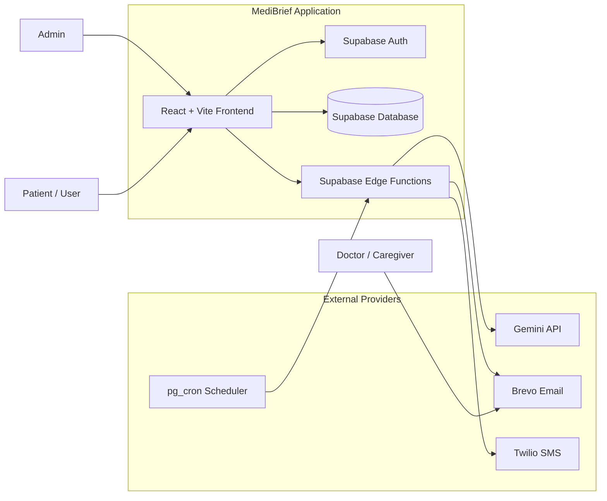
```mermaid
flowchart LR
  USER[Patient / User]
  ADMIN[Admin]
  DOCTOR[Doctor / Caregiver]

  subgraph APP["MediBrief Application"]
    FRONTEND[React + Vite Frontend]
    AUTH[Supabase Auth]
    DB[(Supabase Database)]
    FUNCTIONS[Supabase Edge Functions]
  end

  subgraph PROVIDERS["External Providers"]
    AI[Gemini API]
    EMAIL[Brevo Email]
    SMS[Twilio SMS]
    JOB[pg_cron Scheduler]
  end

  USER --> FRONTEND
  ADMIN --> FRONTEND
  DOCTOR --> EMAIL

  FRONTEND --> AUTH
  FRONTEND --> DB
  FRONTEND --> FUNCTIONS

  FUNCTIONS --> AI
  FUNCTIONS --> EMAIL
  FUNCTIONS --> SMS
  JOB --> FUNCTIONS
```

---

## 2. Use Case Diagram

This detailed use case diagram shows the main actions performed by users and admins, along with the supporting systems those actions depend on such as authentication, database storage, AI analysis, email delivery, SMS delivery, and the reminder scheduler.

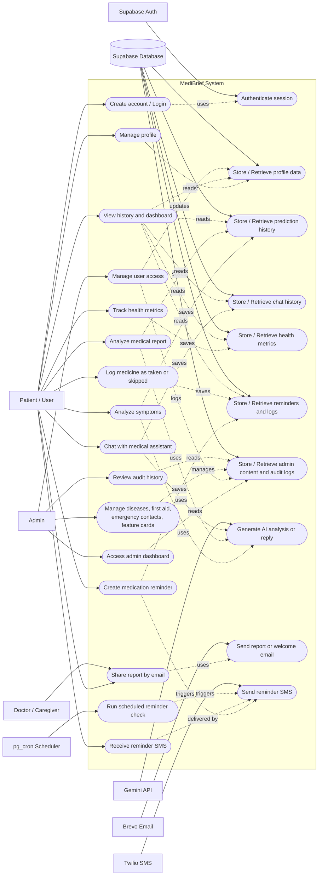
```mermaid
flowchart LR
  USER[Patient / User]
  ADMIN[Admin]
  DOCTOR[Doctor / Caregiver]
  AUTH[Supabase Auth]
  DB[(Supabase Database)]
  AI[Gemini API]
  EMAIL[Brevo Email]
  SMS[Twilio SMS]
  CRON[pg_cron Scheduler]

  subgraph SYSTEM["MediBrief System"]
    UC1([Create account / Login])
    UC2([Manage profile])
    UC3([Analyze symptoms])
    UC4([Analyze medical report])
    UC5([Chat with medical assistant])
    UC6([Track health metrics])
    UC7([Create medication reminder])
    UC8([Log medicine as taken or skipped])
    UC9([Receive reminder SMS])
    UC10([View history and dashboard])
    UC11([Share report by email])
    UC12([Access admin dashboard])
    UC13([Manage user access])
    UC14([Manage diseases, first aid,<br/>emergency contacts, feature cards])
    UC15([Review audit history])

    S1([Authenticate session])
    S2([Store / Retrieve profile data])
    S3([Store / Retrieve prediction history])
    S4([Store / Retrieve chat history])
    S5([Store / Retrieve health metrics])
    S6([Store / Retrieve reminders and logs])
    S7([Store / Retrieve admin content and audit logs])
    S8([Generate AI analysis or reply])
    S9([Send report or welcome email])
    S10([Send reminder SMS])
    S11([Run scheduled reminder check])
  end

  USER --> UC1
  USER --> UC2
  USER --> UC3
  USER --> UC4
  USER --> UC5
  USER --> UC6
  USER --> UC7
  USER --> UC8
  USER --> UC9
  USER --> UC10
  USER --> UC11

  ADMIN --> UC12
  ADMIN --> UC13
  ADMIN --> UC14
  ADMIN --> UC15

  DOCTOR --> UC11

  UC1 -. uses .-> S1
  UC2 -. uses .-> S2
  UC3 -. uses .-> S8
  UC3 -. saves .-> S3
  UC4 -. uses .-> S8
  UC4 -. saves .-> S3
  UC5 -. uses .-> S8
  UC5 -. saves .-> S4
  UC6 -. saves .-> S5
  UC7 -. saves .-> S6
  UC7 -. triggers .-> S10
  UC8 -. saves .-> S6
  UC9 -. delivered by .-> S10
  UC10 -. reads .-> S2
  UC10 -. reads .-> S3
  UC10 -. reads .-> S4
  UC10 -. reads .-> S5
  UC10 -. reads .-> S6
  UC11 -. uses .-> S9
  UC12 -. reads .-> S7
  UC13 -. updates .-> S2
  UC13 -. logs .-> S7
  UC14 -. manages .-> S7
  UC15 -. reads .-> S7
  S11 -. triggers .-> S10

  AUTH --> S1
  DB --> S2
  DB --> S3
  DB --> S4
  DB --> S5
  DB --> S6
  DB --> S7
  AI --> S8
  EMAIL --> S9
  SMS --> S10
  CRON --> S11
```

---

## 3. DFD Level 0 - Context Diagram

This is the top-level data flow diagram. It treats MediBrief as one system and shows what enters and leaves the system.

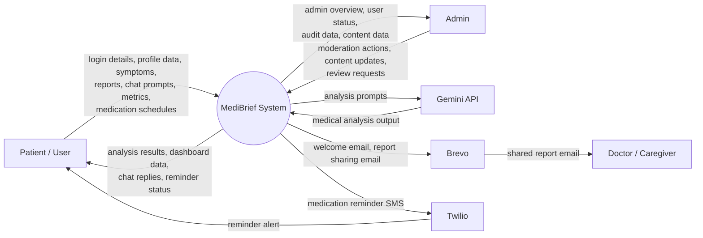
```mermaid
flowchart LR
  USER[Patient / User]
  ADMIN[Admin]
  DOCTOR[Doctor / Caregiver]
  AI[Gemini API]
  EMAIL[Brevo]
  SMS[Twilio]
  SYS((MediBrief System))

  USER -->|login details, profile data, symptoms,<br/>reports, chat prompts, metrics,<br/>medication schedules| SYS
  SYS -->|analysis results, dashboard data,<br/>chat replies, reminder status| USER

  ADMIN -->|moderation actions, content updates,<br/>review requests| SYS
  SYS -->|admin overview, user status,<br/>audit data, content data| ADMIN

  SYS -->|analysis prompts| AI
  AI -->|medical analysis output| SYS

  SYS -->|welcome email, report sharing email| EMAIL
  EMAIL -->|shared report email| DOCTOR

  SYS -->|medication reminder SMS| SMS
  SMS -->|reminder alert| USER
```

---

## 4. DFD Level 1 - Internal Process Diagrams

The Level 1 DFD is split into six focused diagrams. Each one covers one clear process area, so the flows are easier to read and easier to explain.

### 4.1 Authentication and User Profile DFD

This diagram focuses only on account access and user profile management.

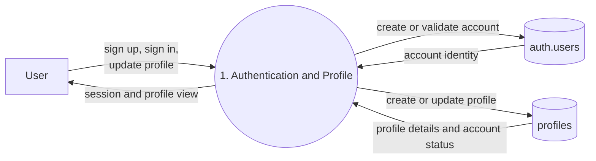
```mermaid
flowchart LR
  USER[User]
  P1((1. Authentication and Profile))
  D1[(auth.users)]
  D2[(profiles)]

  USER -->|sign up, sign in,<br/>update profile| P1
  P1 -->|create or validate account| D1
  P1 -->|create or update profile| D2
  D1 -->|account identity| P1
  D2 -->|profile details and account status| P1
  P1 -->|session and profile view| USER
```

### 4.2 Symptom Analysis DFD

This diagram shows how symptom input is analyzed by AI and saved as a prediction.

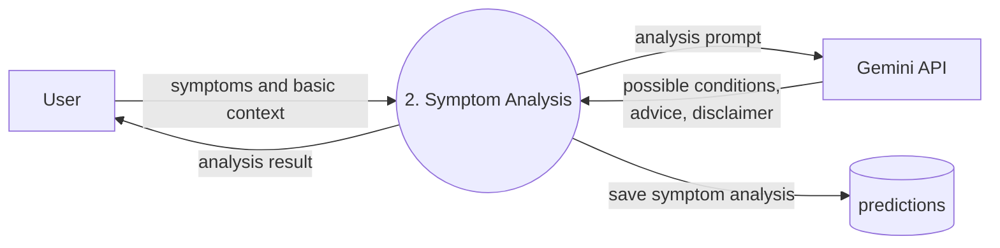
```mermaid
flowchart LR
  USER[User]
  AI[Gemini API]
  P2((2. Symptom Analysis))
  D3[(predictions)]

  USER -->|symptoms and basic context| P2
  P2 -->|analysis prompt| AI
  AI -->|possible conditions,<br/>advice, disclaimer| P2
  P2 -->|save symptom analysis| D3
  P2 -->|analysis result| USER
```

### 4.3 Medical Report Analysis DFD

This diagram shows how uploaded or pasted medical report data is analyzed and stored.

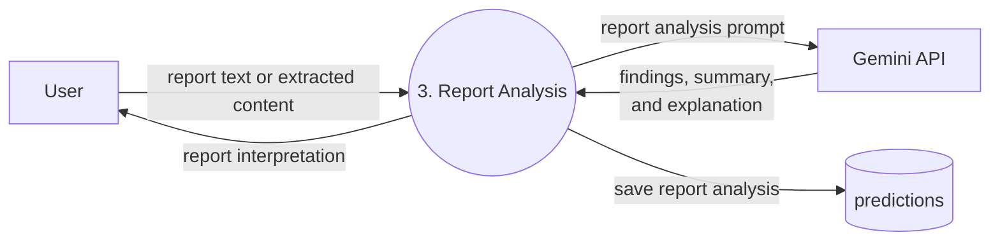
```mermaid
flowchart LR
  USER[User]
  AI[Gemini API]
  P3((3. Report Analysis))
  D3[(predictions)]

  USER -->|report text or extracted content| P3
  P3 -->|report analysis prompt| AI
  AI -->|findings, summary,<br/>and explanation| P3
  P3 -->|save report analysis| D3
  P3 -->|report interpretation| USER
```

### 4.4 Medical Chat DFD

This diagram shows the conversational AI flow and how chat history is stored.

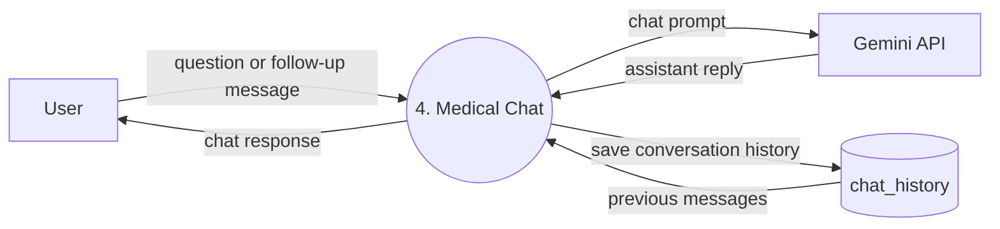
```mermaid
flowchart LR
  USER[User]
  AI[Gemini API]
  P4((4. Medical Chat))
  D4[(chat_history)]

  USER -->|question or follow-up message| P4
  P4 -->|chat prompt| AI
  AI -->|assistant reply| P4
  P4 -->|save conversation history| D4
  D4 -->|previous messages| P4
  P4 -->|chat response| USER
```

### 4.5 Health Tracking and Reminder Communication DFD

This diagram shows how health data is stored and how medication reminders trigger SMS communication.

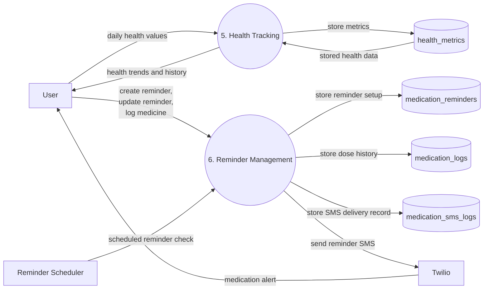
```mermaid
flowchart LR
  USER[User]
  CRON[Reminder Scheduler]
  SMS[Twilio]
  P5((5. Health Tracking))
  P6((6. Reminder Management))
  D5[(health_metrics)]
  D6[(medication_reminders)]
  D7[(medication_logs)]
  D8[(medication_sms_logs)]

  USER -->|daily health values| P5
  P5 -->|store metrics| D5
  D5 -->|stored health data| P5
  P5 -->|health trends and history| USER

  USER -->|create reminder,<br/>update reminder,<br/>log medicine| P6
  P6 -->|store reminder setup| D6
  P6 -->|store dose history| D7
  P6 -->|store SMS delivery record| D8
  CRON -->|scheduled reminder check| P6
  P6 -->|send reminder SMS| SMS
  SMS -->|medication alert| USER
```

### 4.6 Email Delivery and Admin Management DFD

This diagram shows the communication and control side of the system: email sending and admin actions.

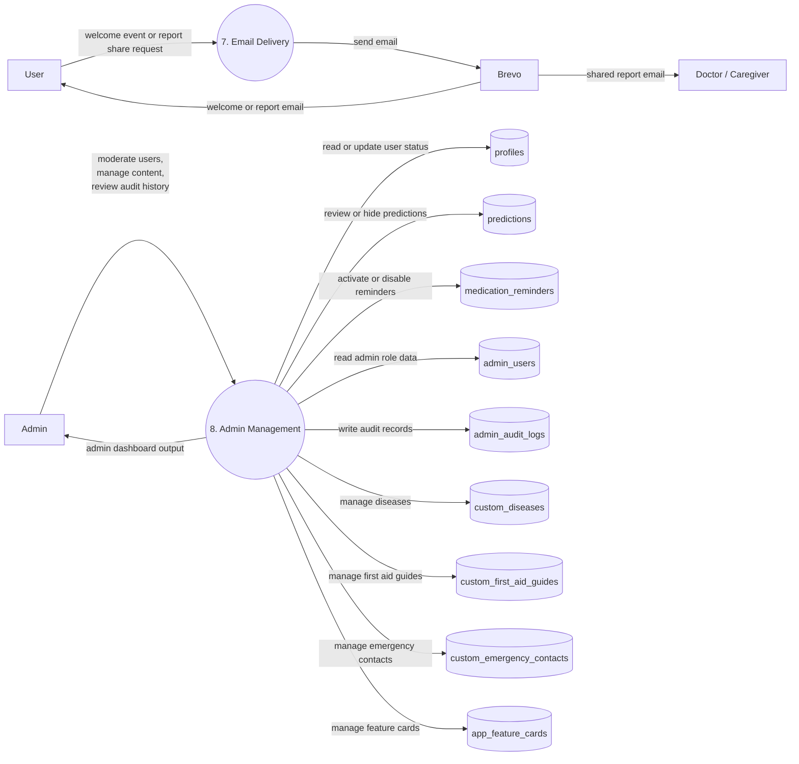
```mermaid
flowchart LR
  USER[User]
  DOCTOR[Doctor / Caregiver]
  ADMIN[Admin]
  EMAIL[Brevo]
  P7((7. Email Delivery))
  P8((8. Admin Management))

  D2[(profiles)]
  D3[(predictions)]
  D6[(medication_reminders)]
  D9[(admin_users)]
  D10[(admin_audit_logs)]
  D11[(custom_diseases)]
  D12[(custom_first_aid_guides)]
  D13[(custom_emergency_contacts)]
  D14[(app_feature_cards)]

  USER -->|welcome event or report share request| P7
  P7 -->|send email| EMAIL
  EMAIL -->|welcome or report email| USER
  EMAIL -->|shared report email| DOCTOR

  ADMIN -->|moderate users,<br/>manage content,<br/>review audit history| P8
  P8 -->|read or update user status| D2
  P8 -->|review or hide predictions| D3
  P8 -->|activate or disable reminders| D6
  P8 -->|read admin role data| D9
  P8 -->|write audit records| D10
  P8 -->|manage diseases| D11
  P8 -->|manage first aid guides| D12
  P8 -->|manage emergency contacts| D13
  P8 -->|manage feature cards| D14
  P8 -->|admin dashboard output| ADMIN
```

---

## 5. ERD Chain Diagram

This is the database relationship view in a chain-style layout. It shows how user identity flows into profile, health records, predictions, reminders, admin controls, and admin-managed content.

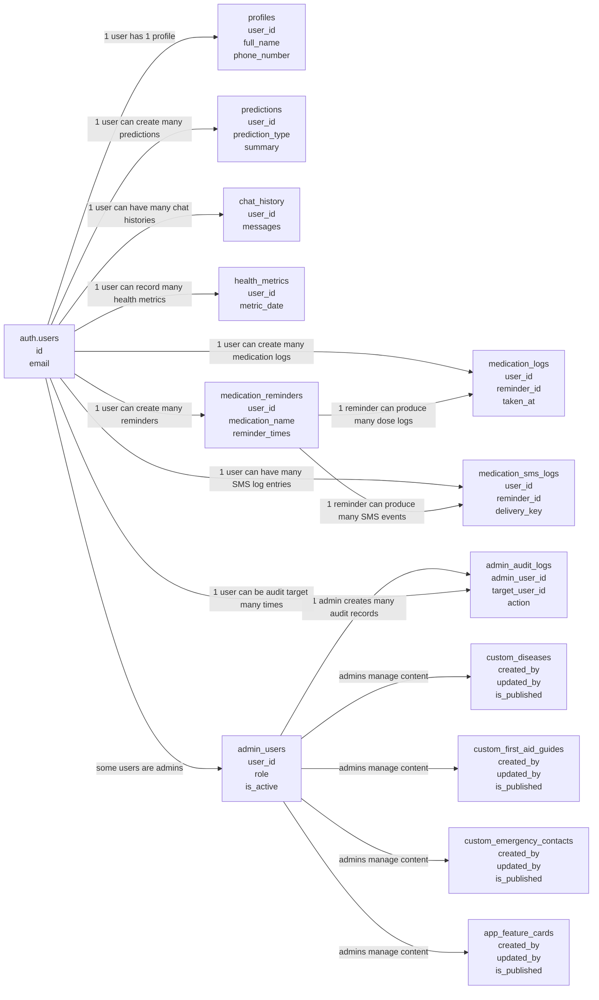
```mermaid
flowchart LR
  AU["auth.users<br/>id<br/>email"]
  PR["profiles<br/>user_id<br/>full_name<br/>phone_number"]
  PD["predictions<br/>user_id<br/>prediction_type<br/>summary"]
  CH["chat_history<br/>user_id<br/>messages"]
  HM["health_metrics<br/>user_id<br/>metric_date"]
  MR["medication_reminders<br/>user_id<br/>medication_name<br/>reminder_times"]
  ML["medication_logs<br/>user_id<br/>reminder_id<br/>taken_at"]
  MS["medication_sms_logs<br/>user_id<br/>reminder_id<br/>delivery_key"]
  AD["admin_users<br/>user_id<br/>role<br/>is_active"]
  AA["admin_audit_logs<br/>admin_user_id<br/>target_user_id<br/>action"]
  CD["custom_diseases<br/>created_by<br/>updated_by<br/>is_published"]
  FA["custom_first_aid_guides<br/>created_by<br/>updated_by<br/>is_published"]
  EC["custom_emergency_contacts<br/>created_by<br/>updated_by<br/>is_published"]
  FC["app_feature_cards<br/>created_by<br/>updated_by<br/>is_published"]

  AU -->|1 user has 1 profile| PR
  AU -->|1 user can create many predictions| PD
  AU -->|1 user can have many chat histories| CH
  AU -->|1 user can record many health metrics| HM
  AU -->|1 user can create many reminders| MR
  AU -->|1 user can create many medication logs| ML
  AU -->|1 user can have many SMS log entries| MS

  MR -->|1 reminder can produce many dose logs| ML
  MR -->|1 reminder can produce many SMS events| MS

  AU -->|some users are admins| AD
  AD -->|1 admin creates many audit records| AA
  AU -->|1 user can be audit target many times| AA

  AD -->|admins manage content| CD
  AD -->|admins manage content| FA
  AD -->|admins manage content| EC
  AD -->|admins manage content| FC
```

---

## 6. Activity Diagrams - Separate User and Admin Flows

These activity diagrams are separated properly into:

- the normal user or patient activity flow
- the admin console activity flow

This makes the main product journey easier to follow without mixing patient actions and admin moderation actions in the same diagram.

### 6.1 User Activity Diagram

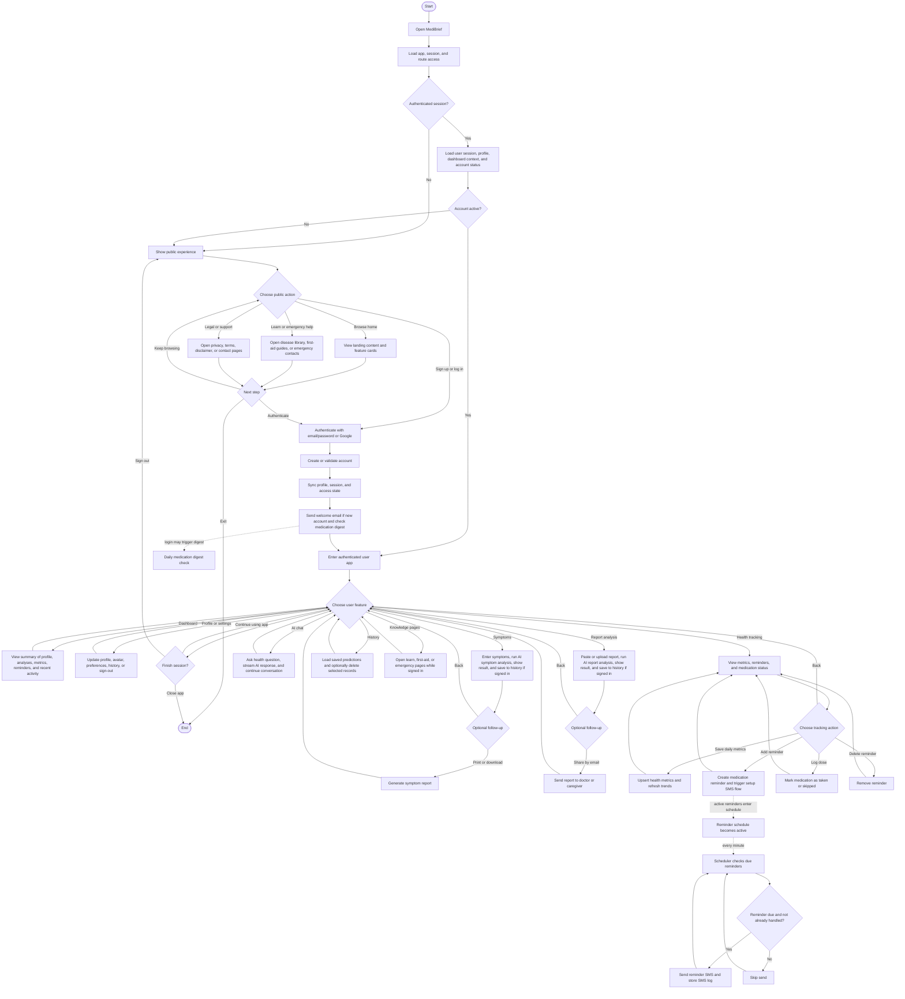
```mermaid
flowchart TD
  A([Start]) --> B[Open MediBrief]
  B --> C[Load app, session, and route access]
  C --> D{Authenticated session?}

  D -- No --> E[Show public experience]
  D -- Yes --> F[Load user session, profile, dashboard context, and account status]

  F --> G{Account active?}
  G -- No --> E
  G -- Yes --> H[Enter authenticated user app]

  E --> I{Choose public action}
  I -- Browse home --> J[View landing content and feature cards]
  I -- Learn or emergency help --> K[Open disease library, first-aid guides, or emergency contacts]
  I -- Legal or support --> L[Open privacy, terms, disclaimer, or contact pages]
  I -- Sign up or log in --> M[Authenticate with email/password or Google]

  J --> N{Next step}
  K --> N
  L --> N
  N -- Keep browsing --> I
  N -- Authenticate --> M
  N -- Exit --> Z([End])

  M --> O[Create or validate account]
  O --> P[Sync profile, session, and access state]
  P --> Q[Send welcome email if new account and check medication digest]
  Q --> H

  H --> R{Choose user feature}

  R -- Dashboard --> S[View summary of profile, analyses, metrics, reminders, and recent activity]
  S --> R

  R -- Profile or settings --> T[Update profile, avatar, preferences, history, or sign-out]
  T --> R

  R -- Symptoms --> U[Enter symptoms, run AI symptom analysis, show result, and save to history if signed in]
  U --> V{Optional follow-up}
  V -- Print or download --> W[Generate symptom report]
  V -- Back --> R
  W --> R

  R -- Report analysis --> X[Paste or upload report, run AI report analysis, show result, and save to history if signed in]
  X --> Y{Optional follow-up}
  Y -- Share by email --> AA[Send report to doctor or caregiver]
  Y -- Back --> R
  AA --> R

  R -- AI chat --> AB[Ask health question, stream AI response, and continue conversation]
  AB --> R

  R -- Health tracking --> AC[View metrics, reminders, and medication status]
  AC --> AD{Choose tracking action}
  AD -- Save daily metrics --> AE[Upsert health metrics and refresh trends]
  AD -- Add reminder --> AF[Create medication reminder and trigger setup SMS flow]
  AD -- Log dose --> AG[Mark medication as taken or skipped]
  AD -- Delete reminder --> AH[Remove reminder]
  AD -- Back --> R
  AE --> AC
  AF --> AC
  AG --> AC
  AH --> AC

  R -- History --> AI[Load saved predictions and optionally delete selected records]
  AI --> R

  R -- Knowledge pages --> AJ[Open learn, first-aid, or emergency pages while signed in]
  AJ --> R

  Q -. login may trigger digest .-> AK[Daily medication digest check]
  AF -. active reminders enter schedule .-> AL[Reminder schedule becomes active]
  AL -. every minute .-> AM[Scheduler checks due reminders]
  AM --> AN{Reminder due and not already handled?}
  AN -- Yes --> AO[Send reminder SMS and store SMS log]
  AN -- No --> AP[Skip send]
  AO --> AM
  AP --> AM

  R --> AQ{Finish session?}
  AQ -- Continue using app --> R
  AQ -- Sign out --> E
  AQ -- Close app --> Z
```

### 6.2 Admin Activity Diagram

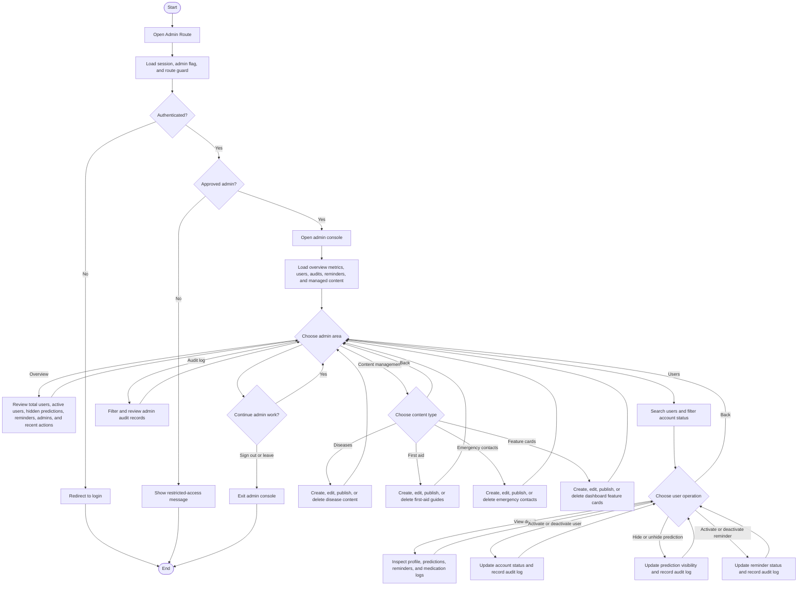
```mermaid
flowchart TD
  A([Start]) --> B[Open Admin Route]
  B --> C[Load session, admin flag, and route guard]
  C --> D{Authenticated?}

  D -- No --> E[Redirect to login]
  E --> Z([End])

  D -- Yes --> F{Approved admin?}
  F -- No --> G[Show restricted-access message]
  G --> Z
  F -- Yes --> H[Open admin console]

  H --> I[Load overview metrics, users, audits, reminders, and managed content]
  I --> J{Choose admin area}

  J -- Overview --> K[Review total users, active users, hidden predictions, reminders, admins, and recent actions]
  K --> J

  J -- Users --> L[Search users and filter account status]
  L --> M{Choose user operation}
  M -- View detail --> N[Inspect profile, predictions, reminders, and medication logs]
  M -- Activate or deactivate user --> O[Update account status and record audit log]
  M -- Hide or unhide prediction --> P[Update prediction visibility and record audit log]
  M -- Activate or deactivate reminder --> Q[Update reminder status and record audit log]
  M -- Back --> J
  N --> M
  O --> M
  P --> M
  Q --> M

  J -- Audit log --> R[Filter and review admin audit records]
  R --> J

  J -- Content management --> S{Choose content type}
  S -- Diseases --> T[Create, edit, publish, or delete disease content]
  S -- First aid --> U[Create, edit, publish, or delete first-aid guides]
  S -- Emergency contacts --> V[Create, edit, publish, or delete emergency contacts]
  S -- Feature cards --> W[Create, edit, publish, or delete dashboard feature cards]
  S -- Back --> J
  T --> J
  U --> J
  V --> J
  W --> J

  J --> X{Continue admin work?}
  X -- Yes --> J
  X -- Sign out or leave --> Y[Exit admin console]
  Y --> Z
```

---

## 7. Sequence Diagrams - Separate User and Admin Runtime Flows

These sequence diagrams are now separated properly into two different runtime views:

- one for the patient or user journey
- one for the admin console journey

This keeps the patient-side health flows and the admin-side moderation flows easier to read and easier to present.

### 7.1 User Sequence Diagram Part 1 - App Access and Authentication

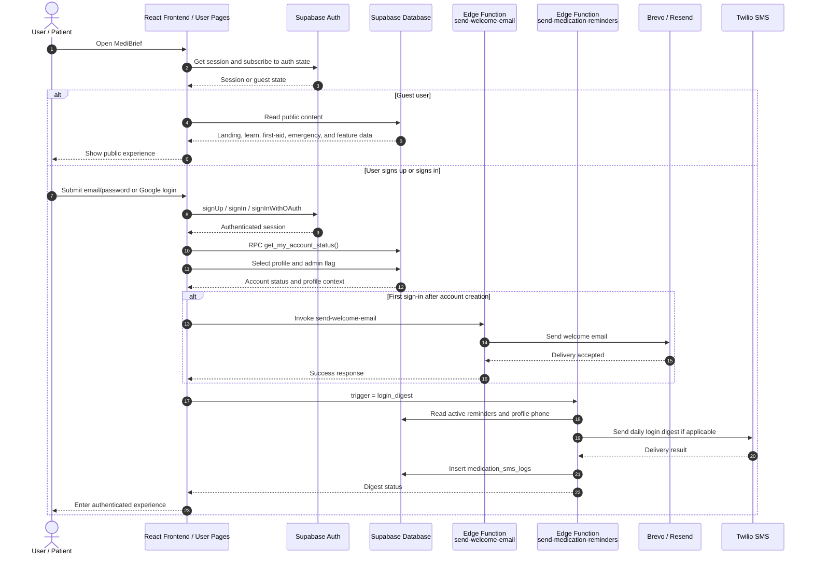
```mermaid
sequenceDiagram
  autonumber
  actor User as User / Patient
  participant WEB as React Frontend / User Pages
  participant AUTH as Supabase Auth
  participant DB as Supabase Database
  participant FWEL as Edge Function<br/>send-welcome-email
  participant FREM as Edge Function<br/>send-medication-reminders
  participant EMAIL as Brevo / Resend
  participant SMS as Twilio SMS

  User->>WEB: Open MediBrief
  WEB->>AUTH: Get session and subscribe to auth state
  AUTH-->>WEB: Session or guest state

  alt Guest user
    WEB->>DB: Read public content
    DB-->>WEB: Landing, learn, first-aid, emergency, and feature data
    WEB-->>User: Show public experience
  else User signs up or signs in
    User->>WEB: Submit email/password or Google login
    WEB->>AUTH: signUp / signIn / signInWithOAuth
    AUTH-->>WEB: Authenticated session
    WEB->>DB: RPC get_my_account_status()
    WEB->>DB: Select profile and admin flag
    DB-->>WEB: Account status and profile context

    alt First sign-in after account creation
      WEB->>FWEL: Invoke send-welcome-email
      FWEL->>EMAIL: Send welcome email
      EMAIL-->>FWEL: Delivery accepted
      FWEL-->>WEB: Success response
    end

    WEB->>FREM: trigger = login_digest
    FREM->>DB: Read active reminders and profile phone
    FREM->>SMS: Send daily login digest if applicable
    SMS-->>FREM: Delivery result
    FREM->>DB: Insert medication_sms_logs
    FREM-->>WEB: Digest status
    WEB-->>User: Enter authenticated experience
  end
```

### 7.2 User Sequence Diagram Part 2 - Dashboard, Profile, and Settings

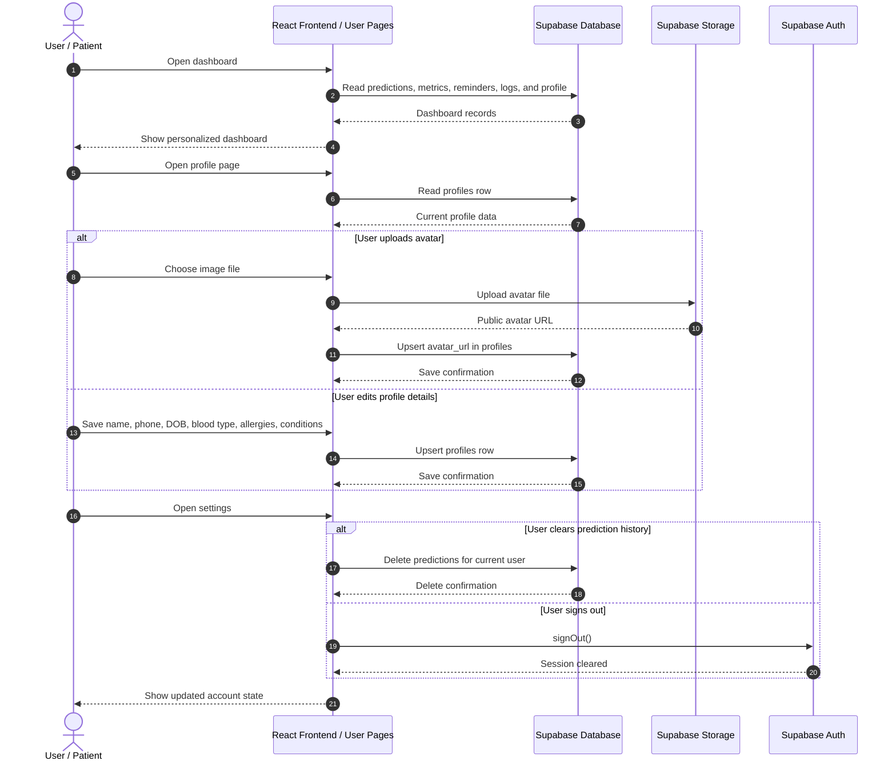
```mermaid
sequenceDiagram
  autonumber
  actor User as User / Patient
  participant WEB as React Frontend / User Pages
  participant DB as Supabase Database
  participant STORAGE as Supabase Storage
  participant AUTH as Supabase Auth

  User->>WEB: Open dashboard
  WEB->>DB: Read predictions, metrics, reminders, logs, and profile
  DB-->>WEB: Dashboard records
  WEB-->>User: Show personalized dashboard

  User->>WEB: Open profile page
  WEB->>DB: Read profiles row
  DB-->>WEB: Current profile data

  alt User uploads avatar
    User->>WEB: Choose image file
    WEB->>STORAGE: Upload avatar file
    STORAGE-->>WEB: Public avatar URL
    WEB->>DB: Upsert avatar_url in profiles
    DB-->>WEB: Save confirmation
  else User edits profile details
    User->>WEB: Save name, phone, DOB, blood type, allergies, conditions
    WEB->>DB: Upsert profiles row
    DB-->>WEB: Save confirmation
  end

  User->>WEB: Open settings
  alt User clears prediction history
    WEB->>DB: Delete predictions for current user
    DB-->>WEB: Delete confirmation
  else User signs out
    WEB->>AUTH: signOut()
    AUTH-->>WEB: Session cleared
  end
  WEB-->>User: Show updated account state
```

### 7.3 User Sequence Diagram Part 3 - Symptom Analysis

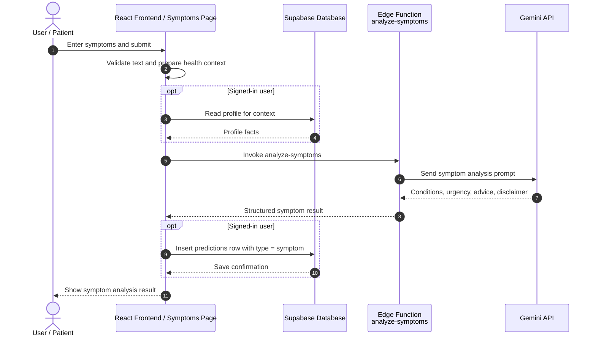
```mermaid
sequenceDiagram
  autonumber
  actor User as User / Patient
  participant WEB as React Frontend / Symptoms Page
  participant DB as Supabase Database
  participant FSYM as Edge Function<br/>analyze-symptoms
  participant AI as Gemini API

  User->>WEB: Enter symptoms and submit
  WEB->>WEB: Validate text and prepare health context
  opt Signed-in user
    WEB->>DB: Read profile for context
    DB-->>WEB: Profile facts
  end
  WEB->>FSYM: Invoke analyze-symptoms
  FSYM->>AI: Send symptom analysis prompt
  AI-->>FSYM: Conditions, urgency, advice, disclaimer
  FSYM-->>WEB: Structured symptom result
  opt Signed-in user
    WEB->>DB: Insert predictions row with type = symptom
    DB-->>WEB: Save confirmation
  end
  WEB-->>User: Show symptom analysis result
```

### 7.4 User Sequence Diagram Part 4 - Report Analysis and Sharing

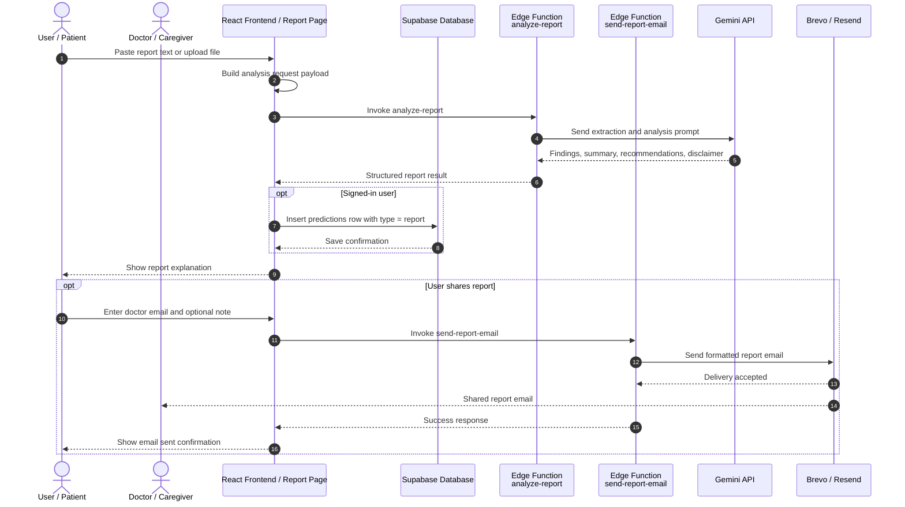
```mermaid
sequenceDiagram
  autonumber
  actor User as User / Patient
  actor Doctor as Doctor / Caregiver
  participant WEB as React Frontend / Report Page
  participant DB as Supabase Database
  participant FRPT as Edge Function<br/>analyze-report
  participant FMAIL as Edge Function<br/>send-report-email
  participant AI as Gemini API
  participant EMAIL as Brevo / Resend

  User->>WEB: Paste report text or upload file
  WEB->>WEB: Build analysis request payload
  WEB->>FRPT: Invoke analyze-report
  FRPT->>AI: Send extraction and analysis prompt
  AI-->>FRPT: Findings, summary, recommendations, disclaimer
  FRPT-->>WEB: Structured report result
  opt Signed-in user
    WEB->>DB: Insert predictions row with type = report
    DB-->>WEB: Save confirmation
  end
  WEB-->>User: Show report explanation

  opt User shares report
    User->>WEB: Enter doctor email and optional note
    WEB->>FMAIL: Invoke send-report-email
    FMAIL->>EMAIL: Send formatted report email
    EMAIL-->>FMAIL: Delivery accepted
    EMAIL-->>Doctor: Shared report email
    FMAIL-->>WEB: Success response
    WEB-->>User: Show email sent confirmation
  end
```

### 7.5 User Sequence Diagram Part 5 - AI Chat

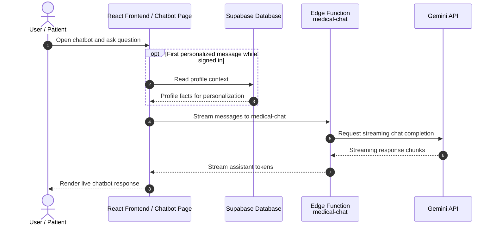
```mermaid
sequenceDiagram
  autonumber
  actor User as User / Patient
  participant WEB as React Frontend / Chatbot Page
  participant DB as Supabase Database
  participant FCHAT as Edge Function<br/>medical-chat
  participant AI as Gemini API

  User->>WEB: Open chatbot and ask question
  opt First personalized message while signed in
    WEB->>DB: Read profile context
    DB-->>WEB: Profile facts for personalization
  end
  WEB->>FCHAT: Stream messages to medical-chat
  FCHAT->>AI: Request streaming chat completion
  AI-->>FCHAT: Streaming response chunks
  FCHAT-->>WEB: Stream assistant tokens
  WEB-->>User: Render live chatbot response
```

### 7.6 User Sequence Diagram Part 6 - Health Tracking and Medication Actions

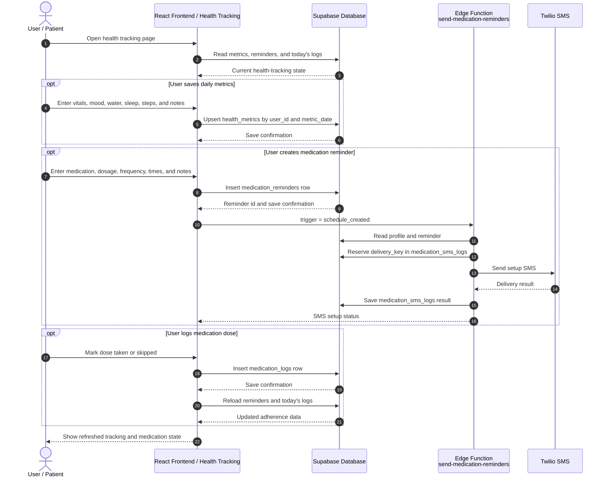
```mermaid
sequenceDiagram
  autonumber
  actor User as User / Patient
  participant WEB as React Frontend / Health Tracking
  participant DB as Supabase Database
  participant FREM as Edge Function<br/>send-medication-reminders
  participant SMS as Twilio SMS

  User->>WEB: Open health tracking page
  WEB->>DB: Read metrics, reminders, and today's logs
  DB-->>WEB: Current health-tracking state

  opt User saves daily metrics
    User->>WEB: Enter vitals, mood, water, sleep, steps, and notes
    WEB->>DB: Upsert health_metrics by user_id and metric_date
    DB-->>WEB: Save confirmation
  end

  opt User creates medication reminder
    User->>WEB: Enter medication, dosage, frequency, times, and notes
    WEB->>DB: Insert medication_reminders row
    DB-->>WEB: Reminder id and save confirmation
    WEB->>FREM: trigger = schedule_created
    FREM->>DB: Read profile and reminder
    FREM->>DB: Reserve delivery_key in medication_sms_logs
    FREM->>SMS: Send setup SMS
    SMS-->>FREM: Delivery result
    FREM->>DB: Save medication_sms_logs result
    FREM-->>WEB: SMS setup status
  end

  opt User logs medication dose
    User->>WEB: Mark dose taken or skipped
    WEB->>DB: Insert medication_logs row
    DB-->>WEB: Save confirmation
    WEB->>DB: Reload reminders and today's logs
    DB-->>WEB: Updated adherence data
  end

  WEB-->>User: Show refreshed tracking and medication state
```

### 7.7 User Sequence Diagram Part 7 - History and Scheduled Reminder Processing

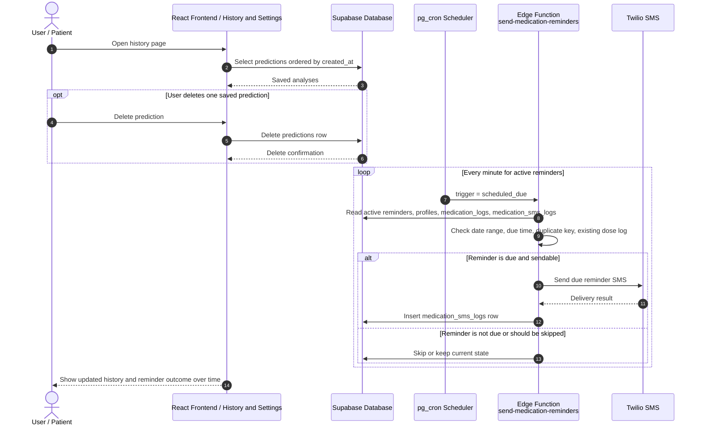
```mermaid
sequenceDiagram
  autonumber
  actor User as User / Patient
  participant WEB as React Frontend / History and Settings
  participant DB as Supabase Database
  participant CRON as pg_cron Scheduler
  participant FREM as Edge Function<br/>send-medication-reminders
  participant SMS as Twilio SMS

  User->>WEB: Open history page
  WEB->>DB: Select predictions ordered by created_at
  DB-->>WEB: Saved analyses

  opt User deletes one saved prediction
    User->>WEB: Delete prediction
    WEB->>DB: Delete predictions row
    DB-->>WEB: Delete confirmation
  end

  loop Every minute for active reminders
    CRON->>FREM: trigger = scheduled_due
    FREM->>DB: Read active reminders, profiles, medication_logs, medication_sms_logs
    FREM->>FREM: Check date range, due time, duplicate key, existing dose log
    alt Reminder is due and sendable
      FREM->>SMS: Send due reminder SMS
      SMS-->>FREM: Delivery result
      FREM->>DB: Insert medication_sms_logs row
    else Reminder is not due or should be skipped
      FREM->>DB: Skip or keep current state
    end
  end

  WEB-->>User: Show updated history and reminder outcome over time
```

### 7.8 Admin Sequence Diagram - Admin Console Runtime Flow

```mermaid
sequenceDiagram
  autonumber
  actor Admin
  participant WEB as React Frontend / Admin Console
  participant ROUTE as AdminRoute / AuthContext
  participant AUTH as Supabase Auth
  participant DB as Supabase Database

  Admin->>WEB: Open /admin
  WEB->>ROUTE: Check route protection
  ROUTE->>AUTH: Read current session
  AUTH-->>ROUTE: Session or no session

  alt No session
    ROUTE-->>WEB: Redirect to /login
    WEB-->>Admin: Show login page
  else Session exists
    ROUTE->>DB: Read admin_users and account status
    DB-->>ROUTE: isAdmin flag and access state

    alt User is not approved admin
      ROUTE-->>WEB: Deny route access
      WEB-->>Admin: Show admin access required message
    else Approved admin
      ROUTE-->>WEB: Allow admin console render

      WEB->>DB: RPC admin_get_overview
      WEB->>DB: RPC admin_list_users
      WEB->>DB: RPC admin_list_audit_logs
      WEB->>DB: Select custom_diseases
      WEB->>DB: Select custom_first_aid_guides
      WEB->>DB: Select custom_emergency_contacts
      WEB->>DB: Select app_feature_cards
      DB-->>WEB: Overview metrics, users, audits, and managed content
      WEB-->>Admin: Show admin overview tabs
    end
  end

  opt Admin filters or searches users
    Admin->>WEB: Enter search term or status filter
    WEB->>DB: RPC admin_list_users(search_term, status_filter)
    DB-->>WEB: Filtered user list
    WEB-->>Admin: Show matching accounts
  end

  opt Admin opens one user's detail dialog
    Admin->>WEB: Click View on user
    WEB->>DB: RPC admin_get_user_detail(target_user_id)
    DB-->>WEB: Profile, predictions, reminders, medication logs
    WEB-->>Admin: Show detailed user record
  end

  opt Admin moderates account status
    Admin->>WEB: Deactivate or reactivate user
    WEB->>WEB: Collect moderation reason when required
    WEB->>DB: RPC admin_set_user_status(target_user_id, next_is_active, reason)
    DB->>DB: Update profiles.is_account_active
    DB->>DB: Insert admin_audit_logs row
    DB-->>WEB: Mutation success
    WEB->>DB: Reload overview, users, audits, and selected user detail
    DB-->>WEB: Refreshed admin state
    WEB-->>Admin: Show action saved message
  end

  opt Admin moderates prediction visibility
    Admin->>WEB: Hide or unhide prediction
    WEB->>WEB: Collect reason when hiding
    WEB->>DB: RPC admin_set_prediction_visibility(target_prediction_id, next_is_hidden, reason)
    DB->>DB: Update predictions visibility fields
    DB->>DB: Insert admin_audit_logs row
    DB-->>WEB: Mutation success
    WEB->>DB: Reload overview, audits, and selected user detail
    DB-->>WEB: Refreshed prediction state
    WEB-->>Admin: Show action saved message
  end

  opt Admin moderates medication reminder status
    Admin->>WEB: Deactivate or reactivate reminder
    WEB->>WEB: Collect reason when deactivating
    WEB->>DB: RPC admin_set_medication_reminder_status(target_reminder_id, next_is_active, reason)
    DB->>DB: Update medication_reminders.is_active and status_reason
    DB->>DB: Insert admin_audit_logs row
    DB-->>WEB: Mutation success
    WEB->>DB: Reload overview, audits, and selected user detail
    DB-->>WEB: Refreshed reminder state
    WEB-->>Admin: Show action saved message
  end

  opt Admin reviews audit history
    Admin->>WEB: Open Audit Log tab and set action filter
    WEB->>DB: RPC admin_list_audit_logs(action_filter)
    DB-->>WEB: Filtered audit entries
    WEB-->>Admin: Show audit log table
  end

  opt Admin manages disease content
    Admin->>WEB: Create, edit, publish, or delete custom disease
    WEB->>DB: Insert / update / delete custom_diseases row
    DB->>DB: Insert admin_audit_logs row
    DB-->>WEB: Save confirmation
    WEB->>DB: Reload admin content and published disease data
    DB-->>WEB: Refreshed content state
    WEB-->>Admin: Show updated disease content
  end

  opt Admin manages first-aid content
    Admin->>WEB: Create, edit, publish, or delete first-aid guide
    WEB->>DB: Insert / update / delete custom_first_aid_guides row
    DB->>DB: Insert admin_audit_logs row
    DB-->>WEB: Save confirmation
    WEB->>DB: Reload admin and published first-aid data
    DB-->>WEB: Refreshed content state
    WEB-->>Admin: Show updated first-aid library
  end

  opt Admin manages emergency contacts
    Admin->>WEB: Create, edit, publish, or delete emergency contact
    WEB->>DB: Insert / update / delete custom_emergency_contacts row
    DB->>DB: Insert admin_audit_logs row
    DB-->>WEB: Save confirmation
    WEB->>DB: Reload admin and published emergency contact data
    DB-->>WEB: Refreshed content state
    WEB-->>Admin: Show updated emergency contacts
  end

  opt Admin manages dashboard feature cards
    Admin->>WEB: Create, edit, publish, or delete feature card
    WEB->>DB: Insert / update / delete app_feature_cards row
    DB->>DB: Insert admin_audit_logs row
    DB-->>WEB: Save confirmation
    WEB->>DB: Reload admin and published feature card data
    DB-->>WEB: Refreshed content state
    WEB-->>Admin: Show updated feature cards
  end
```

---

## 8. Collaboration Diagrams - Separate User and Admin Interaction Views

These collaboration diagrams complement the sequence diagrams by showing the same runtime behavior as communication maps. Each link is numbered to show the order of collaboration between the main runtime objects, while the layout emphasizes who is working with whom.

### 8.1 User Collaboration Diagram

```mermaid
flowchart LR
  subgraph ACTORS["Actors"]
    USER[User / Patient]
    DOCTOR[Doctor / Caregiver]
  end

  subgraph CLIENT["Client Runtime"]
    WEB[React Frontend / User Pages]
  end

  subgraph PLATFORM["Application Platform"]
    AUTH[Supabase Auth]
    DB[(Supabase Database)]
    STORAGE[Supabase Storage]
    FSYM[analyze-symptoms]
    FRPT[analyze-report]
    FCHAT[medical-chat]
    FMAIL[send-report-email]
    FWEL[send-welcome-email]
    FREM[send-medication-reminders]
    CRON[pg_cron Scheduler]
  end

  subgraph PROVIDERS["External Providers"]
    AI[Gemini API]
    EMAIL[Brevo / Resend]
    SMS[Twilio SMS]
  end

  USER -->|1 open app and navigate| WEB
  WEB -->|2 check current session| AUTH
  AUTH -->|3 return guest or authenticated state| WEB
  WEB -->|4 load public content and user records| DB
  DB -->|5 return content, profile, dashboard, and history data| WEB

  USER -->|6 submit sign up or sign in| WEB
  WEB -->|7 authenticate credentials or OAuth login| AUTH
  AUTH -->|8 return authenticated session| WEB
  WEB -->|9 send welcome-email request for new account| FWEL
  FWEL -->|10 deliver welcome email| EMAIL
  WEB -->|11 trigger login_digest reminder check| FREM
  FREM -->|12 read active reminders and profile phone| DB
  FREM -->|13 send digest SMS when applicable| SMS
  FREM -->|14 write medication_sms_logs entry| DB

  USER -->|15 update profile, settings, or avatar| WEB
  WEB -->|16 update profiles row and other account data| DB
  WEB -->|17 upload avatar asset when provided| STORAGE
  STORAGE -->|18 return stored avatar URL| WEB

  USER -->|19 request symptom analysis| WEB
  WEB -->|20 invoke analyze-symptoms| FSYM
  FSYM -->|21 request AI symptom interpretation| AI
  AI -->|22 return conditions, urgency, advice| FSYM
  FSYM -->|23 return symptom result| WEB
  WEB -->|24 save symptom prediction history| DB

  USER -->|25 request report analysis| WEB
  WEB -->|26 invoke analyze-report| FRPT
  FRPT -->|27 request AI report extraction and analysis| AI
  AI -->|28 return findings, summary, recommendations| FRPT
  FRPT -->|29 return report result| WEB
  WEB -->|30 save report prediction history| DB

  USER -->|31 share report with doctor| WEB
  WEB -->|32 invoke send-report-email| FMAIL
  FMAIL -->|33 deliver formatted report email| EMAIL
  EMAIL -->|34 send email to doctor inbox| DOCTOR

  USER -->|35 ask health question in chatbot| WEB
  WEB -->|36 invoke medical-chat| FCHAT
  FCHAT -->|37 request streamed AI reply| AI
  AI -->|38 return streaming response| FCHAT
  FCHAT -->|39 stream chatbot reply to UI| WEB

  USER -->|40 save metrics or manage medications| WEB
  WEB -->|41 upsert health_metrics and medication_logs| DB
  WEB -->|42 insert medication_reminders| DB
  WEB -->|43 trigger schedule_created SMS flow| FREM
  FREM -->|44 read reminder, profile, and delivery state| DB
  FREM -->|45 send setup or reminder SMS| SMS
  FREM -->|46 store medication_sms_logs result| DB

  CRON -->|47 trigger scheduled_due processing| FREM
  FREM -->|48 read due reminders, dose logs, and SMS logs| DB
  FREM -->|49 send due reminder SMS| SMS
  FREM -->|50 persist scheduled reminder result| DB

  USER -->|51 open history or account settings| WEB
  WEB -->|52 read or delete saved prediction history| DB
  WEB -->|53 sign out when requested| AUTH
```

### 8.2 Admin Collaboration Diagram

```mermaid
flowchart LR
  subgraph ACTOR["Actor"]
    ADMIN[Admin]
  end

  subgraph CLIENT["Admin Client Runtime"]
    WEB[React Frontend / Admin Console]
    ROUTE[AdminRoute / AuthContext]
  end

  subgraph PLATFORM["Admin Data Layer"]
    AUTH[Supabase Auth]
    DB[(Supabase Database)]
    USERS[(profiles + admin_users)]
    PRED[(predictions)]
    REM[(medication_reminders)]
    CONTENT[(custom content tables)]
    AUDIT[(admin_audit_logs)]
  end

  ADMIN -->|1 open admin route| WEB
  WEB -->|2 request route protection check| ROUTE
  ROUTE -->|3 read session state| AUTH
  AUTH -->|4 return session result| ROUTE
  ROUTE -->|5 verify admin role and account access| DB
  DB -->|6 return allow or deny decision| ROUTE
  ROUTE -->|7 render admin page or block access| WEB

  WEB -->|8 load overview metrics and counts| DB
  WEB -->|9 load users, audit history, and managed content| DB
  DB -->|10 return overview, users, audits, and content| WEB

  ADMIN -->|11 search or filter users| WEB
  WEB -->|12 query admin user list| USERS
  USERS -->|13 return filtered accounts| WEB

  ADMIN -->|14 open selected user detail| WEB
  WEB -->|15 read profile, predictions, reminders, and logs| DB
  DB -->|16 return user detail payload| WEB

  ADMIN -->|17 activate or deactivate user| WEB
  WEB -->|18 update account state| USERS
  WEB -->|19 write user moderation audit| AUDIT

  ADMIN -->|20 hide or unhide prediction| WEB
  WEB -->|21 update prediction visibility| PRED
  WEB -->|22 write prediction moderation audit| AUDIT

  ADMIN -->|23 activate or deactivate reminder| WEB
  WEB -->|24 update reminder status| REM
  WEB -->|25 write reminder moderation audit| AUDIT

  ADMIN -->|26 create, edit, publish, or delete managed content| WEB
  WEB -->|27 update disease, first-aid, emergency, or feature-card content| CONTENT
  WEB -->|28 write content-management audit| AUDIT

  WEB -->|29 reload overview, user data, audits, and content| DB
  DB -->|30 return refreshed admin state| WEB
  WEB -->|31 show updated console and moderation results| ADMIN
```

---

## 9. State Diagram - Complete Medication Reminder Statechart

This statechart rebuilds the reminder lifecycle from start to end in a more complete way. It includes form entry, validation, database save, setup SMS behavior, active monitoring, login digest participation, scheduled due checks, dose logging, admin deactivation, completion, and deletion.

```mermaid
stateDiagram-v2
  [*] --> Draft: user opens Add Medication form

  Draft --> Validating: submit medication name, dosage, frequency, and times
  Validating --> ValidationError: missing fields or invalid / duplicate reminder times
  ValidationError --> Draft: user corrects input

  Validating --> SavingReminder: input is valid
  SavingReminder --> SaveFailed: database insert fails
  SaveFailed --> Draft: retry save

  SavingReminder --> ReminderSaved: medication_reminders row created

  ReminderSaved --> SetupSmsCheck: trigger = schedule_created
  SetupSmsCheck --> SetupSmsSent: phone exists, delivery key reserved, Twilio accepted
  SetupSmsCheck --> SetupSmsSkipped: phone missing or setup SMS already sent
  SetupSmsCheck --> SetupSmsFailed: provider error, invalid number, or config issue

  SetupSmsSent --> ActiveLifecycle
  SetupSmsSkipped --> ActiveLifecycle
  SetupSmsFailed --> ActiveLifecycle

  state ActiveLifecycle {
    [*] --> AvailabilityCheck

    AvailabilityCheck --> WaitingForStartDate: start_date is in the future
    AvailabilityCheck --> MonitoringSchedule: current date is within active range

    WaitingForStartDate --> MonitoringSchedule: start_date reached

    MonitoringSchedule --> LoginDigestCheck: user signs in
    LoginDigestCheck --> MonitoringSchedule: digest sent, skipped, or already sent today

    MonitoringSchedule --> DueCheck: scheduler runs near reminder time
    DueCheck --> MonitoringSchedule: no matching reminder time yet
    DueCheck --> DueSuppressed: end_date passed, inactive, duplicate SMS, no phone, or dose already logged
    DueCheck --> DueSmsSent: scheduled time matched and SMS delivered
    DueCheck --> DueSmsFailed: Twilio or provider error

    DueSuppressed --> AwaitingDoseAction
    DueSmsSent --> AwaitingDoseAction
    DueSmsFailed --> AwaitingDoseAction

    AwaitingDoseAction --> DoseTaken: user marks dose as taken
    AwaitingDoseAction --> DoseSkipped: user marks dose as skipped

    DoseTaken --> NextDoseDecision
    DoseSkipped --> NextDoseDecision

    NextDoseDecision --> MonitoringSchedule: another dose time or another valid day remains
    NextDoseDecision --> Completed: end_date passed and no future doses remain

    MonitoringSchedule --> Completed: end_date passed
    MonitoringSchedule --> Deactivated: admin or user disables reminder
    Deactivated --> MonitoringSchedule: reminder re-enabled
  }

  ActiveLifecycle --> Deleted: user deletes reminder
  Completed --> Deleted: finished reminder removed
  Deleted --> [*]

  note right of SetupSmsCheck
    Immediately after creation, the app tries the schedule_created SMS flow.
    If SMS fails, the reminder still remains saved and active in the database.
  end note

  note right of LoginDigestCheck
    On sign-in, active reminders may be included in a daily login_digest SMS.
    This is informational and does not change the reminder's core schedule.
  end note

  note right of DueCheck
    The scheduled job runs every minute.
    It checks active reminders, date range, current India time,
    existing medication_logs, and medication_sms_logs before sending.
  end note
```

---

## 10. Class Diagram - Code-Accurate Module and Domain View

This diagram is rebuilt to match the actual MediBrief codebase more closely. Because the project is mostly written with functional React components and module-level utilities rather than traditional OOP classes, this Mermaid class diagram uses UML visibility as follows:

- `+` means exported/public API or externally reachable entrypoint
- `-` means internal helper or local module function
- `#` is intentionally not used here because the current app code does not define its own protected members

It covers the app-owned frontend modules, real class components, edge-function modules, and the main database/domain entities, then joins them so the runtime and data relationships are visible in one place.

```mermaid
classDiagram
  direction LR

  class AppShell {
    <<module>>
    +App()
    -AnimatedRoutes()
    -SkeletonPage()
  }

  class AuthContextModule {
    <<module>>
    +AuthProvider(children)
    +useAuth()
    -syncAccessState(currentUser)
  }

  class SupabaseClient {
    <<module>>
    +supabase
    +from(table)
    +rpc(name, args)
    +invokeFunction(name, body)
    +signUp(payload)
    +signInWithPassword(payload)
    +signInWithOAuth(payload)
    +signOut()
    +getSession()
    +openStorageBucket(bucket)
  }

  class RequestTimeoutError {
    +RequestTimeoutError(fnName, ms)
  }

  class FetchWithTimeoutModule {
    <<module>>
    +getFunctionErrorMessage(error, fallback)
    +withTimeout(promise, ms, label)
    +withRetry(fn, maxRetries, label)
    -normalizeFunctionErrorMessage(message, fallback)
    -readResponseErrorMessage(response)
  }

  class HealthDataModule {
    <<module>>
    +getPredictionDiseaseName(disease)
    +toPredictionDiseases(value)
    +getAgeFromDateOfBirth(dateOfBirth)
    +getHealthProfileFacts(profile)
    +buildHealthProfilePrompt(profile, options)
    -isPredictionDisease(value)
  }

  class MedicationReminderUtils {
    <<module>>
    +MEDICATION_FREQUENCY_OPTIONS
    +getFrequencyLabel(frequency)
    +getReminderTimesCount(frequency)
    +getDefaultReminderTimes(frequency)
    +syncReminderTimesWithFrequency(frequency, reminderTimes)
    +formatReminderTimes(reminderTimes)
  }

  class ProfileValidationModule {
    <<module>>
    +patientNameSchema
    +optionalPhoneSchema
    +requiredPhoneSchema
    +normalizePatientName(value)
    +normalizePhoneNumber(value)
  }

  class ReportExportService {
    <<module>>
    +getProbabilityPercent(probability)
    +getProbabilityLabel(probability)
    +generateReportHTML(data)
    +generateReportText(data)
    +downloadReportPDF(data)
    +downloadReportHTML(data)
    +downloadReport(data)
    +downloadReportText(data)
    +printReport(data)
    +exportReport(data, format)
    -escapeHtml(value)
    -toSafeText(value)
    -toSafeList(values)
    -getReportKind(title)
    -getFileStamp()
    -buildTopicCards(conditions)
    -buildReportBody(data)
  }

  class AdminService {
    <<module>>
    +getAdminOverview()
    +listAdminUsers(searchTerm, statusFilter)
    +getAdminUserDetail(userId)
    +setAdminUserStatus(userId, nextIsActive, reason)
    +setPredictionVisibility(predictionId, nextIsHidden, reason)
    +setMedicationReminderStatus(reminderId, nextIsActive, reason)
    +listAdminAuditLogs(actionFilter)
    -parseJsonResult(value)
  }

  class AdminContentService {
    <<module>>
    +appFeatureIconOptions
    +getAppFeatureIcon(iconName)
    +mapCustomDiseaseToDisease(entry)
    +listPublishedCustomDiseases()
    +listAdminCustomDiseases()
    +createCustomDisease(values)
    +updateCustomDisease(id, values)
    +deleteCustomDisease(id)
    +listPublishedCustomFirstAidGuides()
    +listAdminCustomFirstAidGuides()
    +createCustomFirstAidGuide(values)
    +updateCustomFirstAidGuide(id, values)
    +deleteCustomFirstAidGuide(id)
    +listPublishedCustomEmergencyContacts()
    +listAdminCustomEmergencyContacts()
    +createCustomEmergencyContact(values)
    +updateCustomEmergencyContact(id, values)
    +deleteCustomEmergencyContact(id)
    +listPublishedAppFeatureCards()
    +listAdminAppFeatureCards()
    +createAppFeatureCard(values)
    +updateAppFeatureCard(id, values)
    +deleteAppFeatureCard(id)
    -appFeatureIconMap
  }

  class ErrorBoundary {
    <<component>>
    +state
    +getDerivedStateFromError()
    +componentDidCatch(error, info)
    +handleReload()
    +render()
  }

  class RouteErrorBoundaryInner {
    <<component>>
    +state
    +getDerivedStateFromError(error)
    +componentDidCatch(error, info)
    +handleRetry()
    +handleGoHome()
    +render()
  }

  class RouteErrorBoundary {
    <<module>>
    +RouteErrorBoundary(children, fallbackRoute)
  }

  class DashboardPage {
    <<page>>
    +Dashboard()
    -fetchDashboardData(userId)
    -getPredictionDiseaseName(disease)
    -getPredictionDiseaseProbability(disease)
    -getPredictionDiseaseUrgency(disease)
    -getHealthScoreColor(score)
    -getHealthScoreLabel(score)
  }

  class SymptomsPage {
    <<page>>
    +Symptoms()
    -analyzeSymptoms()
    -handlePrint()
    -handleDownload()
    -getUrgencyColor(urgency)
    -getProbabilityColor(probability)
  }

  class UploadReportPage {
    <<page>>
    +UploadReport()
    -handleFileUpload(event)
    -analyzeReport()
    -handlePrint()
    -handleDownload()
    -clearFile()
    -getStatusColor(status)
    -getLikelihoodColor(likelihood)
  }

  class ChatbotPage {
    <<page>>
    +Chatbot()
    -streamChat(userMessages)
    -sendMessage(messageText)
    -clearChat()
    -handleKeyPress(event)
  }

  class HealthTrackingPage {
    <<page>>
    +HealthTracking()
    -fetchData()
    -fetchMetricsForDate(date)
    -handleSaveMetrics()
    -handleMedicationFrequencyChange(frequency)
    -handleReminderTimeChange(index, value)
    -handleAddMedication()
    -handleLogMedication(reminderId, scheduledTime, taken)
    -handleDeleteReminder(id)
    -getMoodIcon(mood)
    -getDoseLog(reminder, scheduledTime)
    -getCompletedDoseCount(reminder)
  }

  class ProfilePage {
    <<page>>
    +Profile()
    -fetchProfile()
    -handleAvatarUpload(event)
    -handleSave()
    -getInitials()
  }

  class SettingsPage {
    <<page>>
    +Settings()
    -fetchProfile()
    -handleDeleteHistory()
    -handleSignOut()
  }

  class AdminPage {
    <<page>>
    +Admin()
  }

  class AnalyzeSymptomsFn {
    <<edge function>>
    +serve(req)
    -sanitizeText(text)
    -validateSymptoms(symptoms)
    -getAiApiKey()
    -getProviderErrorMessage(providerName, status, rawText)
  }

  class AnalyzeReportFn {
    <<edge function>>
    +serve(req)
    -sanitizeText(text)
    -validateReportText(reportText)
    -getAiApiKey()
    -getProviderErrorMessage(providerName, status, rawText)
    -isSupportedDocumentMimeType(mimeType)
  }

  class MedicalChatFn {
    <<edge function>>
    +serve(req)
    -sanitizeText(text)
    -validateMessages(messages)
    -getAiApiKey()
    -getProviderErrorMessage(providerName, status, rawText)
    -getStreamingResponse(messages)
  }

  class SendReportEmailFn {
    <<edge function>>
    +handler(req)
    -escapeHtml(text)
    -validateEmail(email)
    -validateOptionalString(value, fieldName, maxLength)
    -validateReport(report)
    -getPredictionName(prediction)
    -getPredictionDescription(prediction)
    -buildEmailHtml(report, recipientName)
  }

  class SendWelcomeEmailFn {
    <<edge function>>
    +handler(req)
    -escapeHtml(text)
    -buildWelcomeHtml(name)
  }

  class SendMedicationRemindersFn {
    <<edge function>>
    +serve(req)
    -normalizePhoneNumber(phoneNumber)
    -getIndiaDateTime()
    -getFrequencyLabel(frequency)
    -formatTimes(times)
    -getGreetingName(fullName)
    -truncateMessage(message, maxLength)
    -sendTwilioSms(to, body)
    -reserveDelivery(supabase, payload)
    -releaseDelivery(supabase, deliveryKey)
    -getAuthenticatedUserId(req, supabaseUrl, supabaseAnonKey)
    -requireMatchingUser(authenticatedUserId, requestedUserId)
    -requireCronSecret(req)
    -maybeSingleReminder(supabase, reminderId)
    -getUserProfile(supabase, userId)
    -buildCreatedScheduleMessage(patientName, reminder)
    -buildLoginDigestMessage(patientName, reminders)
    -buildDueReminderMessage(patientName, reminder, scheduledTime)
    -getMatchedReminderTime(reminderTimes, currentTime)
    -sendScheduleCreatedSms(supabase, userId, reminderId)
    -sendLoginDigestSms(supabase, userId)
    -sendScheduledDueSms(supabase)
  }

  class UserAccount {
    <<entity>>
    +id: uuid
    +email: string
    +created_at: datetime
  }

  class Profile {
    <<entity>>
    +user_id: uuid
    +full_name: string
    +phone_number: string
    +date_of_birth: date
    +gender: string
    +blood_type: string
    +height_cm: number
    +weight_kg: number
    +allergies: string
    +medical_conditions: string
    +avatar_url: string
    +is_account_active: boolean
    +account_status_reason: string
  }

  class Prediction {
    <<entity>>
    +id: uuid
    +user_id: uuid
    +prediction_type: string
    +input_data: string
    +predicted_diseases: json
    +summary: string
    +is_hidden: boolean
    +hidden_reason: string
    +created_at: datetime
  }

  class ChatHistory {
    <<entity>>
    +id: uuid
    +user_id: uuid
    +messages: json
    +updated_at: datetime
  }

  class HealthMetric {
    <<entity>>
    +id: uuid
    +user_id: uuid
    +metric_date: date
    +weight: number
    +blood_pressure_systolic: number
    +blood_pressure_diastolic: number
    +heart_rate: number
    +blood_sugar: number
    +sleep_hours: number
    +water_intake: number
    +steps: number
    +mood: string
    +notes: string
  }

  class MedicationReminder {
    <<entity>>
    +id: uuid
    +user_id: uuid
    +medication_name: string
    +dosage: string
    +frequency: string
    +reminder_times: string[]
    +start_date: date
    +end_date: date
    +is_active: boolean
    +status_reason: string
    +notes: string
  }

  class MedicationLog {
    <<entity>>
    +id: uuid
    +user_id: uuid
    +reminder_id: uuid
    +scheduled_time: string
    +taken_at: datetime
    +skipped: boolean
    +notes: string
  }

  class MedicationSmsLog {
    <<entity>>
    +id: uuid
    +user_id: uuid
    +reminder_id: uuid
    +delivery_key: string
    +notification_type: string
    +phone_number: string
    +created_at: datetime
  }

  class AdminUser {
    <<entity>>
    +user_id: uuid
    +role: string
    +is_active: boolean
    +created_at: datetime
  }

  class AdminAuditLog {
    <<entity>>
    +id: uuid
    +admin_user_id: uuid
    +target_user_id: uuid
    +entity_type: string
    +entity_id: uuid
    +action: string
    +reason: string
    +created_at: datetime
  }

  class CustomDisease {
    <<entity>>
    +id: uuid
    +name: string
    +category: string
    +description: string
    +symptoms: json
    +causes: json
    +prevention: json
    +treatment: json
    +risk_factors: json
    +when_to_see_doctor: string
    +is_published: boolean
  }

  class CustomFirstAidGuide {
    <<entity>>
    +id: uuid
    +title: string
    +overview: string
    +steps: json
    +do_not: json
    +is_published: boolean
  }

  class CustomEmergencyContact {
    <<entity>>
    +id: uuid
    +name: string
    +number: string
    +description: string
    +country: string
    +priority: string
    +is_published: boolean
  }

  class AppFeatureCard {
    <<entity>>
    +id: uuid
    +title: string
    +description: string
    +href: string
    +icon_name: string
    +display_order: number
    +is_published: boolean
  }

  AppShell ..> AuthContextModule
  AppShell ..> ErrorBoundary
  AppShell ..> RouteErrorBoundary
  AppShell ..> DashboardPage
  AppShell ..> SymptomsPage
  AppShell ..> UploadReportPage
  AppShell ..> ChatbotPage
  AppShell ..> HealthTrackingPage
  AppShell ..> ProfilePage
  AppShell ..> SettingsPage
  AppShell ..> AdminPage

  AuthContextModule ..> SupabaseClient
  AuthContextModule ..> SendWelcomeEmailFn
  AuthContextModule ..> SendMedicationRemindersFn

  FetchWithTimeoutModule ..> RequestTimeoutError

  DashboardPage ..> AuthContextModule
  DashboardPage ..> SupabaseClient
  DashboardPage ..> AdminContentService
  DashboardPage ..> Prediction
  DashboardPage ..> Profile
  DashboardPage ..> HealthMetric
  DashboardPage ..> MedicationReminder
  DashboardPage ..> MedicationLog
  DashboardPage ..> AppFeatureCard

  SymptomsPage ..> AuthContextModule
  SymptomsPage ..> SupabaseClient
  SymptomsPage ..> FetchWithTimeoutModule
  SymptomsPage ..> HealthDataModule
  SymptomsPage ..> ReportExportService
  SymptomsPage ..> Profile
  SymptomsPage ..> Prediction
  SymptomsPage ..> AnalyzeSymptomsFn

  UploadReportPage ..> AuthContextModule
  UploadReportPage ..> SupabaseClient
  UploadReportPage ..> FetchWithTimeoutModule
  UploadReportPage ..> ReportExportService
  UploadReportPage ..> Prediction
  UploadReportPage ..> AnalyzeReportFn
  UploadReportPage ..> SendReportEmailFn

  ChatbotPage ..> AuthContextModule
  ChatbotPage ..> SupabaseClient
  ChatbotPage ..> HealthDataModule
  ChatbotPage ..> FetchWithTimeoutModule
  ChatbotPage ..> MedicalChatFn
  ChatbotPage ..> Profile

  HealthTrackingPage ..> AuthContextModule
  HealthTrackingPage ..> SupabaseClient
  HealthTrackingPage ..> MedicationReminderUtils
  HealthTrackingPage ..> HealthMetric
  HealthTrackingPage ..> MedicationReminder
  HealthTrackingPage ..> MedicationLog
  HealthTrackingPage ..> SendMedicationRemindersFn

  ProfilePage ..> AuthContextModule
  ProfilePage ..> SupabaseClient
  ProfilePage ..> ProfileValidationModule
  ProfilePage ..> Profile

  SettingsPage ..> AuthContextModule
  SettingsPage ..> SupabaseClient
  SettingsPage ..> Profile
  SettingsPage ..> Prediction

  AdminPage ..> AuthContextModule
  AdminPage ..> AdminService
  AdminPage ..> AdminContentService
  AdminPage ..> AdminUser
  AdminPage ..> AdminAuditLog
  AdminPage ..> Prediction
  AdminPage ..> MedicationReminder
  AdminPage ..> MedicationLog
  AdminPage ..> CustomDisease
  AdminPage ..> CustomFirstAidGuide
  AdminPage ..> CustomEmergencyContact
  AdminPage ..> AppFeatureCard

  AdminService ..> SupabaseClient
  AdminContentService ..> SupabaseClient

  SendMedicationRemindersFn ..> Profile
  SendMedicationRemindersFn ..> MedicationReminder
  SendMedicationRemindersFn ..> MedicationLog
  SendMedicationRemindersFn ..> MedicationSmsLog

  UserAccount --> Profile
  UserAccount --> Prediction
  UserAccount --> ChatHistory
  UserAccount --> HealthMetric
  UserAccount --> MedicationReminder
  UserAccount --> MedicationLog
  UserAccount --> MedicationSmsLog
  UserAccount --> AdminUser

  MedicationReminder --> MedicationLog
  MedicationReminder --> MedicationSmsLog
  AdminUser --> AdminAuditLog
  AdminUser --> CustomDisease
  AdminUser --> CustomFirstAidGuide
  AdminUser --> CustomEmergencyContact
  AdminUser --> AppFeatureCard
```

---

## 11. Package Diagram - Complete Codebase Package Structure

This package diagram is rebuilt from the actual MediBrief folder structure. It shows the real package groups under `src`, the Supabase edge-function packages, the migration packages, and the external provider layer. The goal here is package-level structure, so each node represents a directory package or a tight file-group package rather than an individual component file.

```mermaid
flowchart LR
  subgraph ROOT["MediBrief Repository"]
    subgraph FRONTEND["Frontend Packages - src"]
      BOOT["Bootstrap Package
      main.tsx
      App.tsx"]

      subgraph PAGES["pages Package"]
        P_PUBLIC["Public Pages
        Index
        Learn
        Emergency
        FirstAid
        Contact
        Privacy
        Terms
        MedicalDisclaimer
        NotFound"]
        P_AUTH["Auth Pages
        Login
        Signup
        ResetPassword
        UpdatePassword"]
        P_FEATURES["Core Feature Pages
        Dashboard
        Symptoms
        UploadReport
        Chatbot
        HealthTracking
        History
        Profile
        Settings"]
        P_ADMIN["Admin Page
        Admin"]
      end

      subgraph COMPONENTS["components Package"]
        C_UI["ui Subpackage
        shadcn and Radix wrappers"]
        C_LAYOUT["layout Subpackage
        Layout
        Header
        Footer"]
        C_ADMIN["admin Subpackage
        AdminRoute
        AdminModerationDialog
        AdminContentManager"]
        C_ANIM["animations Subpackage
        PageTransition
        StaggerContainer"]
        C_SKEL["skeletons Subpackage
        route loading skeletons"]
        C_SHARED["Shared Components
        AppFeatureCard
        ShareReportDialog
        ErrorBoundary
        RouteErrorBoundary
        OfflineBanner
        ThemeToggle
        NavLink"]
      end

      CONTEXTS["contexts Package
      AuthContext"]

      HOOKS["hooks Package
      useFormDraft
      usePushNotifications
      usePageMeta
      useToast
      use-mobile"]

      subgraph LIB["lib Package"]
        LIB_HEALTH["Health and Analysis Libs
        healthData
        medicationReminders
        fetchWithTimeout
        downloadReport
        profileValidation"]
        LIB_ADMIN["Admin Libs
        admin
        adminContent"]
        LIB_CONTENT["Content and Utility Libs
        diseases
        diseasesData
        site
        utils"]
      end

      INTEGRATIONS["integrations/supabase Package
      client.ts
      types.ts"]

      TESTS["test Package
      example.test.ts
      setup.ts"]
    end

    subgraph BACKEND["Backend Packages - supabase/functions"]
      FN_ANALYSIS["AI Analysis Functions
      analyze-symptoms
      analyze-report"]
      FN_CHAT["Conversation Functions
      medical-chat
      chat"]
      FN_EMAIL["Email Functions
      send-report-email
      send-welcome-email"]
      FN_REMIND["Reminder Automation Function
      send-medication-reminders"]
      FN_SMS["Direct SMS Function
      send-sms"]
    end

    subgraph DATABASE["Database Packages - supabase/migrations"]
      DB_CORE["Core Auth and User Data Schema
      auth linkage
      profiles
      predictions
      chat_history"]
      DB_HEALTH["Health Tracking Schema
      health_metrics
      medication_reminders
      medication_logs"]
      DB_SMS["SMS Tracking Schema
      medication_sms_logs"]
      DB_ADMIN["Admin Console Schema
      admin_users
      admin_audit_logs
      moderation RPCs"]
      DB_CONTENT["Admin Content Schema
      custom_diseases
      custom_first_aid_guides
      custom_emergency_contacts
      app_feature_cards"]
      DB_SCHED["Reminder Scheduler Schema
      pg_cron
      pg_net
      scheduled reminder job"]
      DB_FIXES["Query and RPC Fix Packages
      admin query fixes
      ambiguity fixes"]
    end

    PUBLIC["public Package
    static web assets"]
  end

  subgraph PROVIDERS["External Provider Packages"]
    AUTHP["Supabase Auth"]
    DBP["Supabase Postgres and Storage"]
    AIP["Google Gemini API"]
    EMAILP["Brevo Email API"]
    SMSP["Twilio SMS API"]
    CRONP["pg_cron and pg_net Runtime"]
  end

  BOOT --> PAGES
  BOOT --> COMPONENTS
  BOOT --> CONTEXTS
  BOOT --> HOOKS
  BOOT --> INTEGRATIONS
  BOOT --> PUBLIC

  P_PUBLIC --> C_LAYOUT
  P_PUBLIC --> C_UI
  P_PUBLIC --> LIB_CONTENT
  P_PUBLIC --> LIB_ADMIN

  P_AUTH --> C_LAYOUT
  P_AUTH --> C_UI
  P_AUTH --> CONTEXTS
  P_AUTH --> LIB_HEALTH
  P_AUTH --> INTEGRATIONS

  P_FEATURES --> C_LAYOUT
  P_FEATURES --> C_UI
  P_FEATURES --> C_ANIM
  P_FEATURES --> C_SKEL
  P_FEATURES --> C_SHARED
  P_FEATURES --> CONTEXTS
  P_FEATURES --> HOOKS
  P_FEATURES --> LIB_HEALTH
  P_FEATURES --> LIB_ADMIN
  P_FEATURES --> LIB_CONTENT
  P_FEATURES --> INTEGRATIONS

  P_ADMIN --> C_LAYOUT
  P_ADMIN --> C_UI
  P_ADMIN --> C_ADMIN
  P_ADMIN --> C_ANIM
  P_ADMIN --> C_SKEL
  P_ADMIN --> CONTEXTS
  P_ADMIN --> LIB_ADMIN
  P_ADMIN --> LIB_CONTENT
  P_ADMIN --> INTEGRATIONS

  C_LAYOUT --> CONTEXTS
  C_ADMIN --> LIB_ADMIN
  C_SHARED --> LIB_HEALTH
  C_SHARED --> LIB_ADMIN

  CONTEXTS --> INTEGRATIONS
  HOOKS --> INTEGRATIONS
  LIB_HEALTH --> INTEGRATIONS
  LIB_ADMIN --> INTEGRATIONS

  INTEGRATIONS --> AUTHP
  INTEGRATIONS --> DBP
  INTEGRATIONS --> FN_ANALYSIS
  INTEGRATIONS --> FN_CHAT
  INTEGRATIONS --> FN_EMAIL
  INTEGRATIONS --> FN_REMIND
  INTEGRATIONS --> FN_SMS

  FN_ANALYSIS --> AIP
  FN_ANALYSIS --> DB_CORE

  FN_CHAT --> AIP

  FN_EMAIL --> EMAILP
  FN_EMAIL --> DB_CORE

  FN_REMIND --> DB_HEALTH
  FN_REMIND --> DB_SMS
  FN_REMIND --> DB_CORE
  FN_REMIND --> SMSP

  FN_SMS --> SMSP

  DB_CORE --> DBP
  DB_HEALTH --> DBP
  DB_SMS --> DBP
  DB_ADMIN --> DBP
  DB_CONTENT --> DBP
  DB_FIXES --> DBP
  DB_SCHED --> CRONP
  DB_SCHED --> FN_REMIND

  DB_ADMIN --> DB_CORE
  DB_CONTENT --> DB_ADMIN
  DB_FIXES --> DB_ADMIN
  DB_FIXES --> DB_HEALTH

  TESTS --> BOOT
  TESTS --> PAGES
  TESTS --> LIB_HEALTH
```

---

## 12. Deployment Diagram - Runtime Architecture

This deployment diagram is rebuilt as a full production runtime view from start to end. It shows deployment configuration, frontend hosting, browser execution, Supabase cloud services, scheduled background processing, and the external providers used for AI, email, SMS, and optional Google sign-in.

```mermaid
flowchart LR
  subgraph CONFIG["Deployment Configuration"]
    VERCEL_ENV["Vercel Environment Variables
    VITE_SUPABASE_URL
    VITE_SUPABASE_PUBLISHABLE_KEY
    VITE_SITE_URL
    VITE_SUPPORT_EMAIL"]

    SUPABASE_SECRETS["Supabase Project Secrets
    SUPABASE_URL
    SUPABASE_ANON_KEY
    SUPABASE_SERVICE_ROLE_KEY
    GOOGLE_GEMINI_API_KEY or LOVABLE_API_KEY
    BREVO_API_KEY
    RESEND_API_KEY
    TWILIO_ACCOUNT_SID
    TWILIO_AUTH_TOKEN
    TWILIO_MESSAGING_SERVICE_SID
    MEDICATION_REMINDER_CRON_SECRET"]
  end

  subgraph ENTRY["Public Entry Layer"]
    DOMAIN["Custom Domain or Vercel URL"]
    CDN["Vercel Edge Network and Static Hosting"]
    BUILD["Vite Production Build
    index.html
    JS and CSS bundles
    public assets"]
  end

  subgraph CLIENT["Client Runtime"]
    USER_BROWSER["Patient Browser
    React SPA
    React Router
    TanStack Query
    Supabase JS Client"]
    ADMIN_BROWSER["Admin Browser
    React SPA
    Admin Console UI"]
    SERVICE_WORKER["Browser Service Worker
    production registration
    static asset caching"]
    PHONE["Patient Mobile Phone
    receives SMS reminders"]
    USER_INBOX["Patient Email Inbox"]
    DOCTOR_INBOX["Doctor or Caregiver Email Inbox"]
  end

  subgraph SUPABASE["Supabase Cloud Runtime"]
    API_GATEWAY["Supabase API and Functions Gateway"]
    AUTH["Supabase Auth
    email/password
    Google OAuth
    session tokens"]
    DB[(Supabase PostgreSQL Database
    profiles
    predictions
    chat_history
    health_metrics
    medication_reminders
    medication_logs
    medication_sms_logs
    admin tables
    content tables)]
    STORAGE["Supabase Storage
    avatars bucket"]

    subgraph EDGE["Supabase Edge Functions"]
      EF_SYM["analyze-symptoms"]
      EF_RPT["analyze-report"]
      EF_MCHAT["medical-chat"]
      EF_CHAT["chat"]
      EF_REPORT["send-report-email"]
      EF_WELCOME["send-welcome-email"]
      EF_REMIND["send-medication-reminders"]
      EF_SMS["send-sms"]
    end

    SCHED["pg_cron and pg_net
    scheduled reminder trigger"]
  end

  subgraph PROVIDERS["Provider Layer"]
    GEMINI["Google Gemini API"]
    BREVO["Brevo Email API"]
    RESEND["Resend Email API
    fallback provider"]
    TWILIO["Twilio SMS API"]
    GOOGLE["Google OAuth Provider"]
  end

  VERCEL_ENV --> CDN
  SUPABASE_SECRETS --> AUTH
  SUPABASE_SECRETS --> EDGE
  SUPABASE_SECRETS --> SCHED

  DOMAIN --> CDN
  CDN --> BUILD
  BUILD --> USER_BROWSER
  BUILD --> ADMIN_BROWSER
  BUILD --> SERVICE_WORKER

  USER_BROWSER --> API_GATEWAY
  ADMIN_BROWSER --> API_GATEWAY
  USER_BROWSER --> SERVICE_WORKER
  ADMIN_BROWSER --> SERVICE_WORKER

  API_GATEWAY --> AUTH
  API_GATEWAY --> DB
  API_GATEWAY --> STORAGE
  API_GATEWAY --> EF_SYM
  API_GATEWAY --> EF_RPT
  API_GATEWAY --> EF_MCHAT
  API_GATEWAY --> EF_CHAT
  API_GATEWAY --> EF_REPORT
  API_GATEWAY --> EF_WELCOME
  API_GATEWAY --> EF_REMIND
  API_GATEWAY --> EF_SMS

  AUTH --> GOOGLE

  USER_BROWSER --> AUTH
  ADMIN_BROWSER --> AUTH
  USER_BROWSER --> DB
  ADMIN_BROWSER --> DB
  USER_BROWSER --> STORAGE

  EF_SYM --> GEMINI
  EF_RPT --> GEMINI
  EF_MCHAT --> GEMINI
  EF_CHAT --> GEMINI

  EF_REPORT --> BREVO
  EF_REPORT --> RESEND
  EF_WELCOME --> BREVO

  EF_REMIND --> DB
  EF_REMIND --> TWILIO
  EF_SMS --> TWILIO

  SCHED --> EF_REMIND

  BREVO --> DOCTOR_INBOX
  RESEND --> DOCTOR_INBOX
  BREVO --> USER_INBOX
  TWILIO --> PHONE
```
