# Health Compass AI - All Mermaid Diagrams

Copy any diagram below and paste it into [Mermaid Live Editor](https://mermaid.live) or any Mermaid-compatible platform.

---

## 1. Entity Relationship Diagram (ERD)

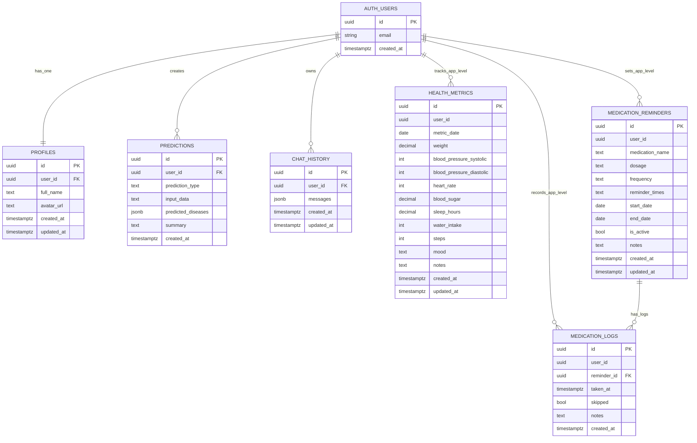

---

## 2. DFD Level 0 - Context Diagram

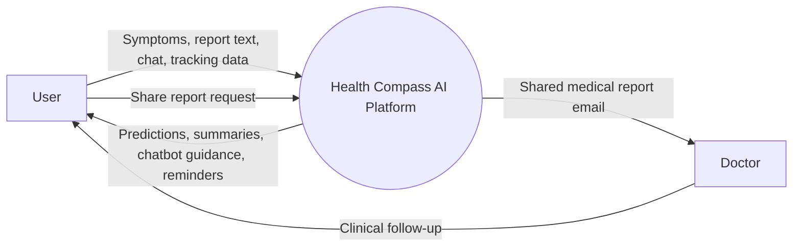

---

## 3. DFD Level 1 - Detailed Process Flow

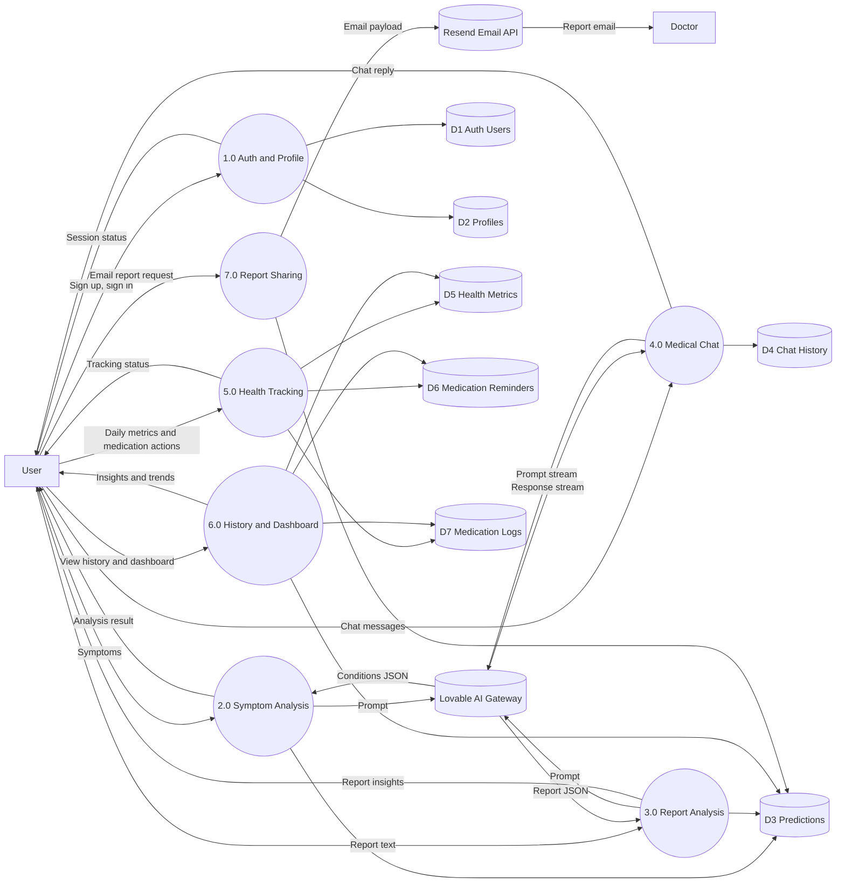

---

## 4. Class Diagram - Conceptual Model

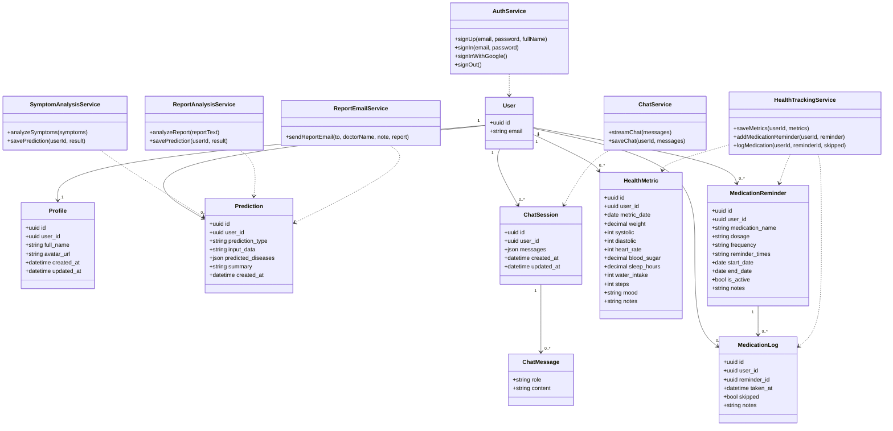

---

## 5. Use Case Diagram

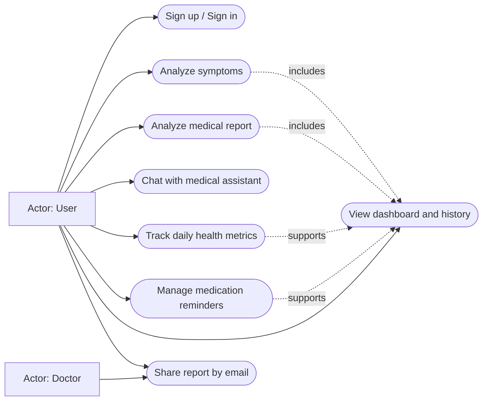

---

## 6. Activity Diagram - Symptom Analysis Flow

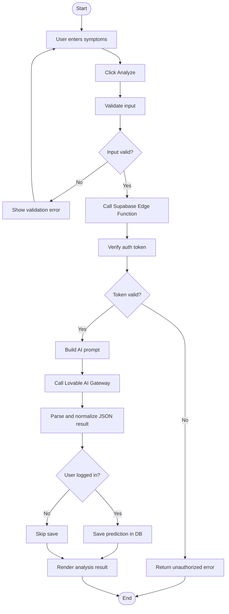

---

## 7. Sequence Diagram - Analyze Symptoms

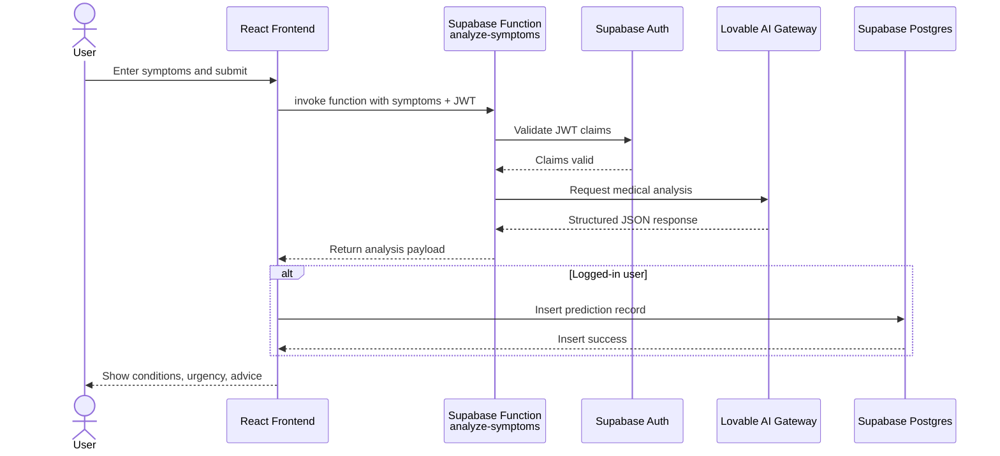

---

## 8. Collaboration Diagram - Communication Flow

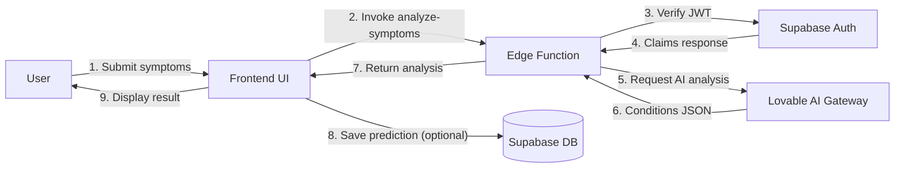

---

## 9. State Chart Diagram - Analysis Request States

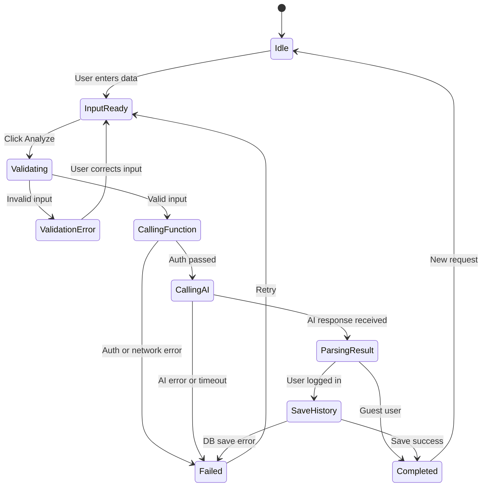

---

## 10. Package Diagram - System Architecture

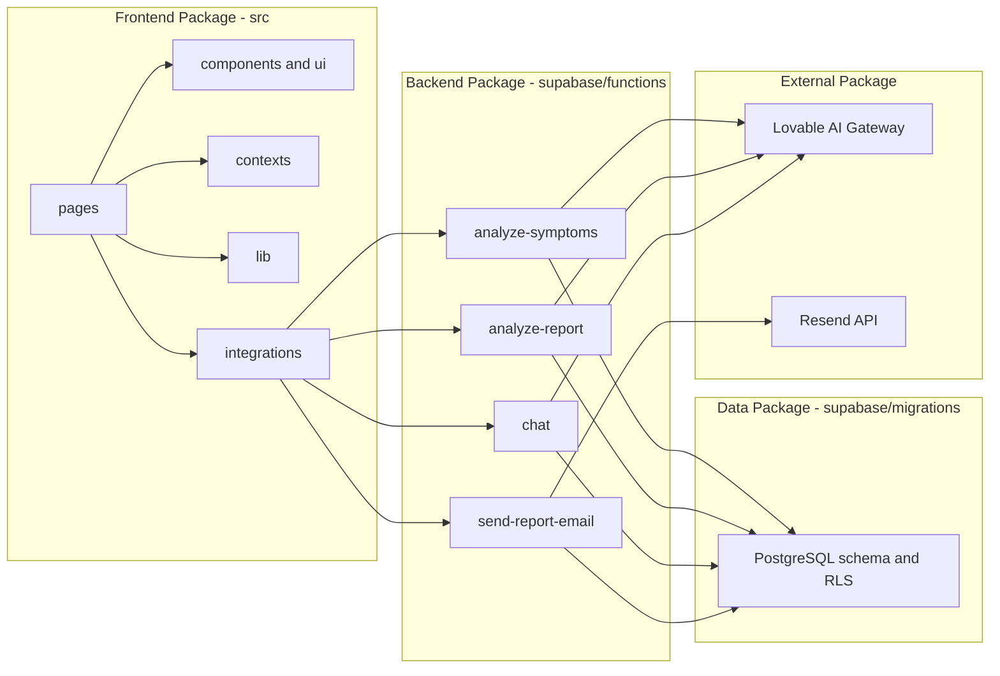

---

## 11. Deployment Diagram - System Infrastructure

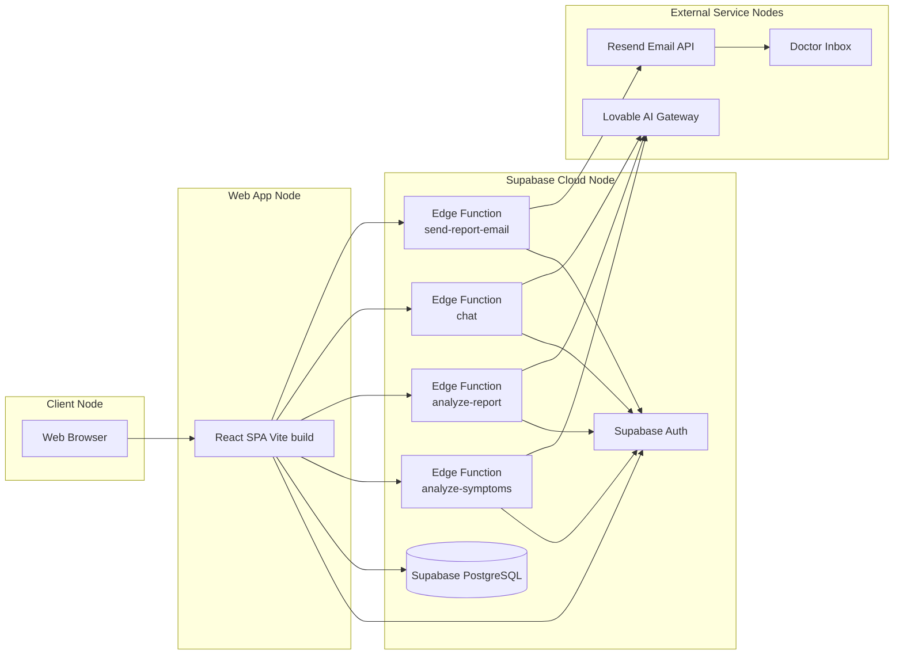

---

## How to Use

1. Copy any diagram code above
2. Visit [Mermaid Live Editor](https://mermaid.live)
3. Paste the code in the editor
4. The diagram will render automatically
5. Download or share as needed

All 11 diagrams are complete and ready to use!
