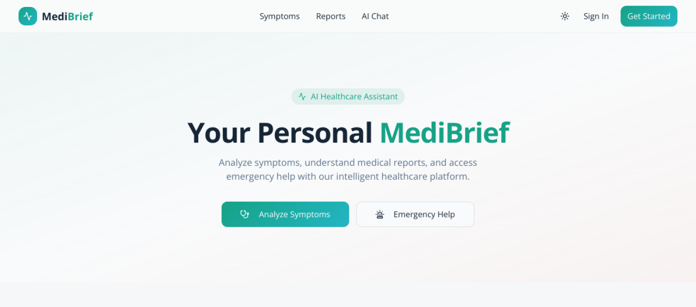
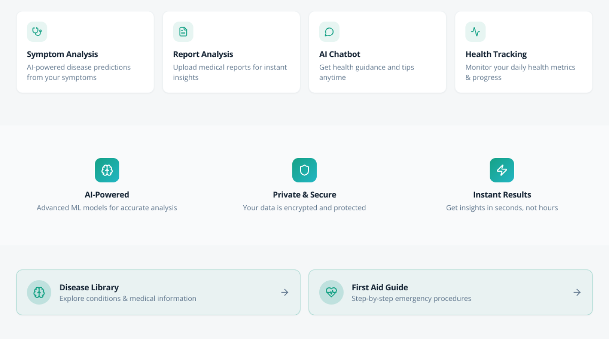

# MediBrief

MediBrief is an AI-assisted health data project built with React, TypeScript, Supabase, PostgreSQL, and serverless edge functions. It helps users analyze symptoms, understand medical reports, chat with an AI assistant, track daily health metrics, and manage medication reminders from one product.

This repository is positioned for data analyst review: it shows structured health data capture, SQL schema design, user history, reminder logs, report summaries, admin monitoring, and clear documentation around sensitive data workflows.

## Live Demo

- App: https://project-14snn.vercel.app

## Screenshots

### Homepage Hero



### Feature Overview



## Features

- AI symptom analysis with structured possible conditions, urgency, and follow-up guidance.
- Medical report analysis from pasted text, PDFs, or images.
- Streaming medical chatbot with health-profile-aware responses.
- Health tracking for weight, blood pressure, sugar, sleep, hydration, steps, and mood.
- Medication reminders with logs and SMS reminder flows.
- Authentication with email/password and Google sign-in.
- Admin console for user moderation, audit logging, and managed health content.

## Data Analyst Focus

- **Structured health records:** user profiles, report history, symptom inputs, health metrics, medication reminders, dose logs, and admin audit events.
- **SQL data modeling:** Supabase PostgreSQL migrations define reproducible tables, relationships, and RPC-style admin workflows.
- **Data interpretation:** symptom and report workflows convert unstructured user input into readable summaries, urgency cues, and saved history.
- **Operational monitoring:** admin tools, audit logs, moderation flows, and reminder delivery records support governance-minded analysis.
- **Dashboard thinking:** health tracking and history pages organize repeated measurements such as weight, blood pressure, sugar, sleep, hydration, steps, and mood.

## Tech Stack

### Frontend

- React 18
- TypeScript
- Vite
- React Router
- TanStack Query

### UI and UX

- Tailwind CSS
- shadcn/ui
- Radix UI
- Framer Motion

### Backend and Platform

- Supabase Auth
- Supabase PostgreSQL
- SQL migrations
- Supabase Edge Functions
- Vercel-ready deployment setup

### External Services

- Gemini AI analysis
- Resend or Brevo for email delivery
- Twilio for SMS reminders

## How It Works

1. Users choose a workflow such as symptom analysis, report analysis, AI chat, or health tracking.
2. The React frontend collects input and sends it to Supabase-backed APIs and edge functions.
3. AI and backend services return summaries, possible conditions, urgency cues, reminders, and saved history.
4. Signed-in users get personalized flows such as report history, medication reminders, and dashboard insights.

## Why This Project Stands Out

- Data-centered architecture: PostgreSQL schema, SQL migrations, user history, reminder logs, health tracking records, and audit trails.
- Real analytical workflows: symptom analysis, report analysis, health metrics tracking, reminders, history, and admin monitoring.
- Production-minded design: route protection, privacy pages, audit logging, environment-based config, security headers, and deployment docs.
- Recruiter-friendly scope: one project that demonstrates data modeling, analytical product thinking, dashboard workflows, and technical implementation together.

## Project Structure

```text
.
|-- src/
|   |-- components/           # Shared UI, layout, admin, and animation components
|   |-- contexts/             # Auth and session state
|   |-- hooks/                # Reusable app hooks
|   |-- integrations/         # Supabase client and generated types
|   |-- lib/                  # Business logic helpers and service modules
|   `-- pages/                # Route-level product pages
|-- supabase/
|   |-- functions/            # Edge functions for AI, email, and reminders
|   `-- migrations/           # Database schema and policy migrations
|-- ALL_MERMAID_DIAGRAMS.md   # System, flow, class, deployment, and collaboration diagrams
|-- DEPLOY_ON_BUDGET.md       # Production launch checklist
`-- vercel.json               # SPA rewrites and security headers
```

## Key Technical Highlights

- Auth-aware UI built around a central `AuthContext` with admin access checks.
- Edge-function integrations for symptom analysis, report analysis, chat, email, and reminder delivery.
- Role-based admin workflows backed by SQL RPC functions and audit trails.
- Health and medication tracking flows modeled in Postgres with reminder and log tables.
- Deployment-oriented configuration for Vercel plus Supabase function secrets.

## Quick Start

### Prerequisites

- Node.js 18+
- npm or bun
- Supabase project

### Install

```bash
git clone <repository-url>
cd MediBrief
npm install
```

### Environment Variables

Create `.env.local` in the project root:

```env
VITE_SUPABASE_URL=https://your-project.supabase.co
VITE_SUPABASE_PUBLISHABLE_KEY=your-anon-key
VITE_SITE_URL=http://localhost:5173
VITE_SUPPORT_EMAIL=you@example.com
```

### Run the App

```bash
npm run dev
```

Open `http://localhost:5173`.

## Scripts

```bash
npm run dev
npm run build
npm run preview
npm run lint
npm run test
npm run test:watch
```

## Deployment Notes

- Frontend is configured for Vercel deployment.
- Backend services run on Supabase.
- Production rollout guidance lives in [DEPLOY_ON_BUDGET.md](./DEPLOY_ON_BUDGET.md).
- Security headers and SPA rewrites are defined in [vercel.json](./vercel.json).

## System Design and Documentation

- Full architecture and UML-style diagrams: [ALL_MERMAID_DIAGRAMS.md](./ALL_MERMAID_DIAGRAMS.md)
- Admin setup guide: [ADMIN_CONSOLE_SETUP.md](./ADMIN_CONSOLE_SETUP.md)
- Budget-focused deployment checklist: [DEPLOY_ON_BUDGET.md](./DEPLOY_ON_BUDGET.md)

## Testing and Quality

- ESLint for static analysis
- Vitest for unit testing
- Structured SQL migrations for reproducible schema changes

## Job Search Positioning

If you are reviewing this repository as part of a hiring process, this project demonstrates:

- SQL database schema design and migration work
- structured health-data capture and history tracking
- dashboard-style organization of user metrics, reminders, and reports
- data governance details such as authentication, role checks, audit logs, and privacy pages
- AI-assisted summarization workflows for unstructured symptom and report inputs
- deployment preparation and production-oriented documentation

## Important Disclaimer

MediBrief provides educational health information and AI-assisted guidance. It is not a substitute for diagnosis, emergency care, treatment, or advice from a licensed medical professional.
